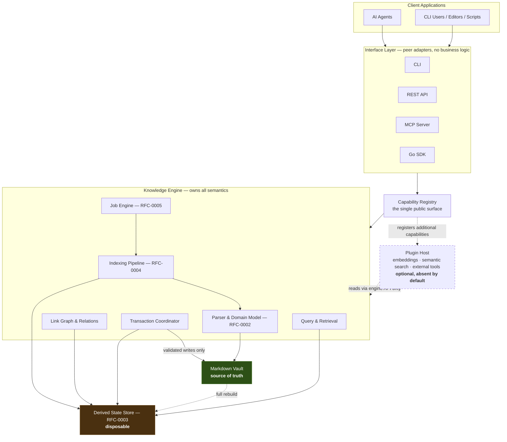
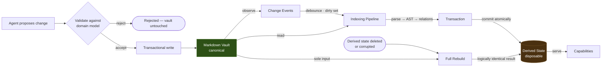
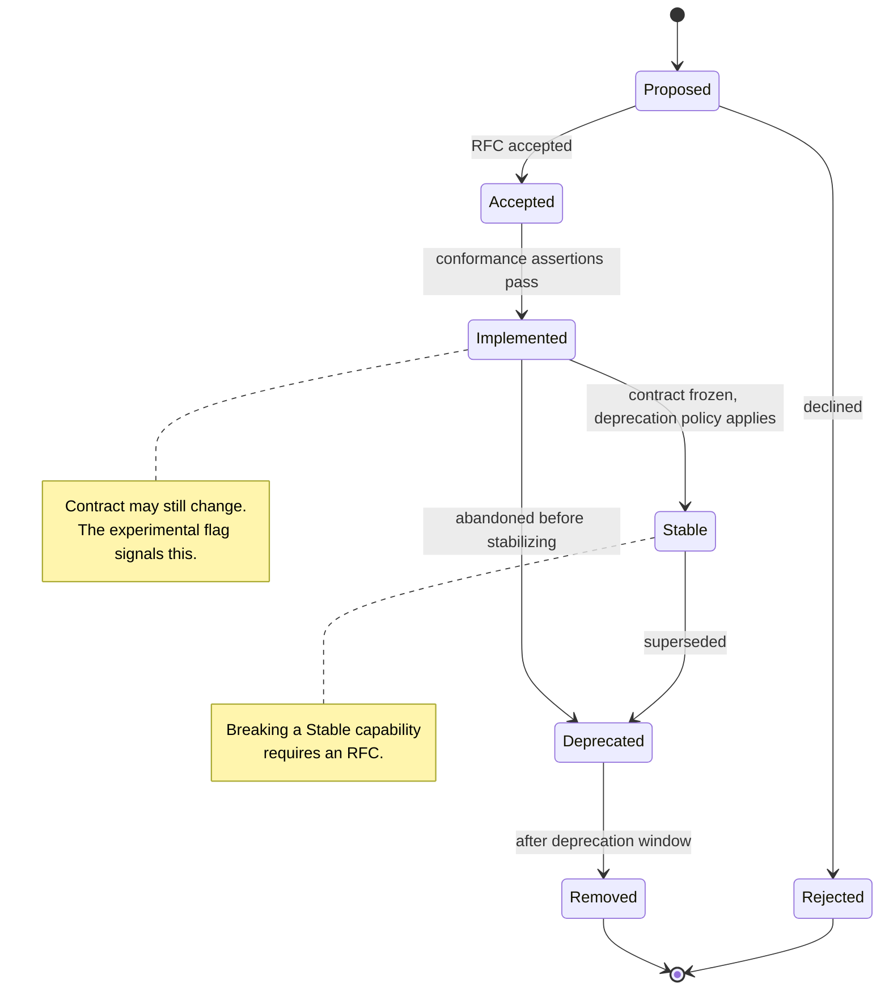

# RFC-0001: Project Vision & Strategic Architecture

## Summary

**Lith** is a local-first semantic knowledge engine for Markdown knowledge bases and Obsidian vaults.

This RFC is the root architectural specification of the project. Every subsequent RFC inherits from it. It defines five things and deliberately nothing else:

1. The **layer model** — which components exist, what each one owns, and what each is forbidden to touch.
2. The **state model** — why Markdown is authoritative and derived state is disposable, expressed as a rebuild guarantee rather than a slogan.
3. The **capability model** — what a capability *is*, how it is identified, versioned, and governed. This RFC defines the model; [docs/reference/capability-catalog.md](../docs/reference/capability-catalog.md) instantiates it.
4. The **plugin boundary** — the rule that keeps semantic infrastructure (embeddings, vector stores, models) permanently outside the core.
5. The **deployment models** the architecture must support without alteration.

It intentionally specifies no schemas, no parsing rules, no file formats, and no APIs. Those belong to RFC-0002 through RFC-0005.

## Motivation

Markdown is the default medium for personal and organizational knowledge. Current AI interaction with Markdown vaults suffers four structural failures:

1. **Context fragmentation.** Tools use glob search, path listing, or fixed-size chunking. Wiki links (`[[link]]`), frontmatter, block references, tags, and the resulting link graph are discarded — precisely the structure that carries the user's own meaning.
2. **Brittle mutation.** Agents apply regex rewrites and whole-file replacements, corrupting links and frontmatter with no rollback path.
3. **Derived-state drift.** Indexes are updated ad hoc, diverge from the files, and there is no defined procedure to prove or restore correctness.
4. **Interface lock-in.** Capable implementations exist as a single MCP wrapper or a single editor plugin, so the engine cannot be reused outside the interface it was born in.

A further, project-specific motivation: Lith is built in a workflow where a large share of implementation is produced by coding agents. Agent-authored code compiles, passes tests, and still silently substitutes a convenient architecture for the intended one. This RFC therefore states its requirements as numbered conformance assertions (see [Conformance](#conformance)) so that divergence is *detectable* rather than a matter of reviewer taste.

## Goals

- Define the layer model and the ownership boundary of each layer.
- Make "SQLite is disposable" a verifiable rebuild guarantee, not an aspiration.
- Define the capability model — identity, metadata, lifecycle, and governance — without enumerating capabilities.
- Establish the plugin boundary that prevents the core from acquiring a dependency on embeddings, vector stores, or models.
- Define deployment models the architecture must satisfy unchanged.
- Provide the conformance assertions that RFC-0002 through RFC-0005 refine and that implementation PRs are reviewed against.

## Non-Goals

This RFC does **not** define:

- Markdown parsing rules, AST shape, link resolution, or frontmatter semantics — RFC-0002.
- Database schema, migration strategy, or rebuild implementation — RFC-0003.
- Job queue, worker pool, scheduling, or transaction implementation — RFC-0005.
- Filesystem watching, debouncing, dirty-set tracking, or incremental indexing — RFC-0004.
- Concrete API surfaces for CLI, REST, MCP, or SDK.
- The capability catalog contents. This RFC defines the model; the catalog is a separate living document.
- Vector storage, embedding generation, semantic ranking, or hybrid retrieval. These are plugin concerns, out of scope for the MVP entirely.

Product-level non-goals (Lith is not an editor, not a sync service, not a web scraper) are stated in [VISION.md](../VISION.md) and are not restated here.

## Background

Lith's constitution is [PROJECT_PRINCIPLES.md](../PROJECT_PRINCIPLES.md). This RFC is the first architectural expression of it: where the constitution says *what must always be true*, this RFC says *what structure makes it true* and *how we detect that it stopped being true*.

Canonical terms — *Vault*, *Workspace*, *Note*, *Block*, *Capability*, *Job*, *Derived State* — are defined in [docs/glossary.md](../docs/glossary.md) and used here in exactly that sense.

## Proposed Design

### 1. System Overview

Lith is a layered engine. Each layer may depend only on the layer directly beneath it. There is exactly one path from an external caller to stored state.



**Layer contracts.** Each layer is defined as much by what it may not do as by what it does:

| Layer | Owns | Forbidden |
| ----- | ---- | --------- |
| **Interface** | Protocol translation, transport, authn/authz at the edge, serialization | Business logic; direct access to the store, parser, or filesystem; exposing anything absent from the capability catalog |
| **Capability Registry** | Capability identity, discovery, dispatch, input validation | Executing domain logic itself |
| **Knowledge Engine** | Parsing, graph construction, indexing, querying, transactions, jobs | Speaking any wire protocol; assuming a specific interface is present |
| **Derived State Store** | Persistence of derived state, atomicity, rebuild | Holding any state not reconstructible from the vault |
| **Plugin Host** | Loading optional capabilities, sandboxing, lifecycle | Being required for the engine to start or for any Core capability to function |
| **Vault** | Canonical truth | Being written by anything other than the Transaction Coordinator |

The direction of the arrows is the architecture. An interface that reaches past the Capability Registry into the store is not a shortcut — it is a different system that happens to compile.

### 2. State Model: Truth and Derivation

Principle 2 says SQLite is disposable. That is only meaningful if we can state it as an operation someone can run:

> Delete every byte of derived state. Re-index the unchanged vault. The resulting logical state is identical.

This is what makes the store safe to corrupt, safe to migrate by deletion, and safe to omit from backups. It is asserted as [C-2](#c-2-rebuild-determinism) and is the single most important invariant in the project.



Two consequences follow, and both constrain every later RFC:

- **Derived state may never be the only home of any fact.** If a fact cannot be recomputed from the vault, storing it makes the store authoritative and breaks Principle 1. Ephemeral runtime state (job queue contents, caches, session state) is exempt only where its loss cannot change a query answer after rebuild.
- **The write path to the vault is singular.** All mutation flows through the Transaction Coordinator, which validates against the domain model before touching a file. There is no second path — not for plugins, not for interfaces, not "just this once" during development ([C-3](#c-3-single-write-path)).

### 3. Capability Model

A **Capability** (see [docs/glossary.md](../docs/glossary.md)) is a domain-level semantic operation exposed to external callers — *what Lith can do*, never *how it does it*. Capabilities are the project's public API surface and its unit of product scope.

**Naming rule.** A capability names an outcome, not a mechanism. `Search` is a capability. `SQLite FTS Search` is not — the storage technology belongs to RFC-0003, and naming it here would make the public surface hostage to an implementation detail.

**Identity.** Every capability carries a stable identifier `CAP-NNNN`, assigned once and never reused. RFCs, issues, and code reference the identifier, not the display name, so renaming `Search` → `Knowledge Query` breaks nothing.

**Metadata.** Every catalog entry declares:

```yaml
id: CAP-0001            # stable, never reused
name: Search            # display name; may change
status: Proposed        # Proposed | Accepted | Implemented | Stable | Deprecated | Removed
                        # illustrative entry — every catalogued capability
                        # is currently Proposed, since no RFC is Accepted
type: Core              # Core | Plugin | Future
category: Knowledge     # grouping for the catalog
mvp: true               # in the first shippable surface?
owner_rfc: "0003"       # the RFC that specifies it
milestone: M1-C         # where it lands
depends_on: []          # other CAP ids
experimental: false     # unstable contract, may change without deprecation
```

**Lifecycle.** Capability lifecycle is *not* RFC lifecycle. An RFC is an architectural decision that reaches a terminal state; a capability is a product feature that keeps moving after the decision is made.



**Governance.**

```text
PROJECT_PRINCIPLES.md                    constitution
        ▼
RFC-0001                                 defines what a capability IS
        ▼
docs/reference/capability-catalog.md     lists which capabilities EXIST
        ▼
RFC-000N                                 defines HOW one is implemented
        ▼
Issues → Pull Requests → Code
```

The catalog is a living document; adding or promoting a capability is a catalog PR referencing its owning RFC. Changing the *model* — the metadata schema, the lifecycle, the identifier scheme — amends this RFC.

**Core vs Plugin.** `type` is an architectural commitment, not a label. A `Core` capability works in a default installation with zero plugins loaded. A `Plugin` capability is optional by construction, and its absence is never an error ([C-6](#c-6-plugin-absence-safety)).

**Search is a hierarchy, not a technology.** Search is a single capability with multiple providers behind one contract. Full-text and metadata search are Core. Graph, semantic, hybrid, and federated search are Plugin or Future. Semantic search is not "better search" — it is another provider of the same capability, and the core must not be able to tell whether it is present.

Note the deliberate separation: **search** answers *find matching notes*; **retrieval** answers *return the most useful context*. The core owns search. Plugins may enhance retrieval.

### 4. The Plugin Boundary

Principle 6 states that vector embeddings are optional plugins. In practice, "optional" erodes: an embedding lifecycle needs invalidation hooks, invalidation needs schema columns, columns need migrations — and the core has silently acquired the dependency it was designed to avoid.

The boundary is therefore stated as a hard architectural constraint, and its **MVP scope is fixed**:

> MVP Search consists exclusively of full-text search over vault content, metadata filtering, and deterministic ranking. Semantic, vector, graph, and hybrid retrieval are separate plugin capabilities and are explicitly out of scope for the MVP.

Two secondary benefits follow. Tests stay deterministic — no model, no GPU, no floating-point similarity, no approximate nearest neighbours anywhere in the M1 test suite ([C-7](#c-7-deterministic-core-search)). And no schema seams are reserved for a design that does not exist yet: whether the eventual implementation is a SQLite extension, an external vector store, or something not yet written is a question we decline to answer prematurely.

#### Proposed Principle Amendment

This RFC proposes adding one tenet to [PROJECT_PRINCIPLES.md](../PROJECT_PRINCIPLES.md), verbatim:

> ### 9. The Core is Semantically Independent
>
> The core engine shall never depend on embeddings, vector databases, or semantic models. These are optional capabilities provided through plugins.

This is stronger than "embeddings are optional": it forbids the core from *growing* the dependency by accretion. Per the constitution's immutability rule and [rfcs/README.md](README.md), the amendment takes effect only when this RFC is `Accepted`; `PROJECT_PRINCIPLES.md` is edited in the same PR that flips the status, not before.

### 5. Component Model

| Component | Responsibility | Specified by |
| --------- | -------------- | ------------ |
| **Vault Observer** | Detect filesystem change, emit ordered events, survive missed events via reconciliation scan | RFC-0004 |
| **Parser & Domain Model** | Markdown → AST → notes, sections, blocks, links, tags, frontmatter | RFC-0002 |
| **Indexing Pipeline** | Dirty-set tracking, incremental re-index, graph construction | RFC-0004 |
| **Transaction Coordinator** | Atomic derived-state commits; validation and application of proposed vault mutations | RFC-0005 |
| **Job Engine** | Async work, queueing, retry, cancellation, crash recovery | RFC-0005 |
| **Derived State Store** | Persistence, atomicity, full rebuild | RFC-0003 |
| **Capability Registry** | Capability identity, discovery, dispatch, validation | RFC-0001 (this), refined per capability |
| **Interface Adapters** | CLI, REST, MCP, SDK as peer adapters | M3 RFCs |
| **Plugin Host** | Optional capability loading and lifecycle | Future RFC |

**Specification order.** RFC-0004 (incremental indexing) is a *consumer* of the transaction semantics defined in RFC-0005. Specifying indexing first would force it to invent its own transaction model, which RFC-0005 would then have to retrofit. The authoring order is therefore **0001 → 0002 → 0003 → 0005 → 0004**; the numbering is unchanged.

### 6. Deployment Models

The architecture must satisfy all three without structural change. Any design that works in only one is rejected at review.

| Model | Shape | Constraint it imposes |
| ----- | ----- | --------------------- |
| **Embedded library** | Linked into a Go binary | No assumption of a daemon, a socket, or a listening port |
| **Local daemon** | Long-lived process beside an editor | Must tolerate concurrent external file mutation and its own restart |
| **Sidecar process** | Beside an agent runner, possibly containerized | No assumption of a desktop session, GUI, or interactive terminal |

Multi-tenant and multi-workspace deployment is out of scope for M1 but must not be structurally excluded: [*Workspace*](../docs/glossary.md#workspace) and [*Tenant*](../docs/glossary.md#tenant) are already defined in the glossary, so the boundary is nameable now and populable later.

## Alternatives Considered

1. **Direct MCP wrapper over the filesystem.** Rejected: no persistent link graph, re-parses on every query, no transactional edit safety, and it locks the engine inside one protocol — violating the peer-interface principle at the architecture's root.
2. **Vector-only store.** Rejected: embeddings discard the structure the user authored deliberately — wiki links, tags, frontmatter taxonomy — and force an external model dependency into the core. It answers *what is similar* while the user is asking *what is connected*.
3. **Capability catalog embedded in this RFC.** Rejected: the catalog changes whenever product scope moves, and every such change would reopen an accepted architectural RFC. Model and instances are separated deliberately.
4. **Reserving vector schema seams now.** Rejected on YAGNI grounds: the target design is unknown, so any seam reserved today is a guess that constrains RFC-0003 and is probably wrong.
5. **A single monolithic architecture RFC.** Rejected: it cannot be reviewed, cannot be partially accepted, and its conformance assertions could not be assigned to distinct milestones.

## Risks

| Risk | Mitigation |
| ---- | ---------- |
| **Architecture erodes under agent-authored implementation** | Conformance assertions are mechanically checkable; PRs are reviewed against assertion IDs before code style |
| **Layer-boundary violations accumulate quietly** | Import-boundary CI check ([C-1](#c-1-core-semantic-independence), [C-5](#c-5-interface-adapter-purity)) fails the build, not the review |
| **Derived state silently becomes authoritative** | Rebuild-determinism test ([C-2](#c-2-rebuild-determinism)) runs in CI against the test vault corpus |
| **Capability surface drifts from the catalog** | Registry-vs-catalog conformance test ([C-4](#c-4-capability-catalog-completeness)) |
| **Over-specification before implementation** | RFCs 0002–0005 specify contracts and invariants, not code structure; anything discoverable only by building is left to implementation |
| **Vault mutated by an external editor mid-operation** | Reconciliation and change-detection semantics deferred to RFC-0004; this RFC only forbids assuming exclusive vault ownership |

## Migration

None. This is the root architectural specification of a project with no implementation.

## Conformance

### C-1: Core semantic independence

**Assertion:** Core engine packages MUST NOT depend, directly or transitively, on embedding libraries, vector databases, model runtimes, or remote inference clients.
**Verification:** CI dependency-boundary check over the resolved import graph of the core packages, evaluated against an explicit allowlist. A new transitive dependency matching the denied set fails the build.
**Milestone:** M1-A

### C-2: Rebuild determinism

**Assertion:** Deleting all derived state and performing a full re-index over an unchanged vault MUST produce logically identical derived state.
**Verification:** Integration test over the committed test vault corpus — index, snapshot a canonicalized dump, delete all derived state, re-index, snapshot again, assert equality. Runs on every CI build.
**Milestone:** M1-B

### C-3: Single write path

**Assertion:** No component other than the Transaction Coordinator MAY write to vault files. Plugins MUST NOT be granted vault write access.
**Verification:** Static check that filesystem write primitives are not referenced outside the transaction package, plus an integration test asserting that a rejected proposal leaves every vault file byte-identical.
**Milestone:** M1-B

### C-4: Capability catalog completeness

**Assertion:** Every capability exposed by any interface MUST have a catalog entry with a `CAP-NNNN` identifier and an `owner_rfc`. Interfaces MUST NOT expose operations absent from the catalog.
**Verification:** Test enumerating the capability registry at runtime and diffing it against [docs/reference/capability-catalog.md](../docs/reference/capability-catalog.md); any symmetric difference fails.
**Milestone:** M1-C

### C-5: Interface adapter purity

**Assertion:** Interface adapters (CLI, REST, MCP, SDK) MUST reach the engine only through the capability registry, and MUST NOT import storage, indexing, or parser packages.
**Verification:** Import-boundary CI check over interface packages against a denied-import set.
**Milestone:** M1-C

### C-6: Plugin absence safety

**Assertion:** The engine MUST start, and every `Core` capability MUST pass its conformance tests, with zero plugins loaded. Absence of a plugin MUST NOT surface as an error.
**Verification:** The default CI test run loads no plugins; a separate run with an empty plugin registry asserts a clean start and a complete Core capability suite.
**Milestone:** M1-A

### C-7: Deterministic core search

**Assertion:** Core search MUST be deterministic — identical corpus plus identical query MUST yield an identically ordered result set, with no dependency on a model, an embedding, or floating-point similarity.
**Verification:** Golden-file test against the committed test vault corpus, executed twice per run in differing process order; results must match the golden byte-for-byte.
**Milestone:** M1-C

### C-8: Canonical terminology

**Assertion:** Domain terms used normatively in any RFC MUST be defined in [docs/glossary.md](../docs/glossary.md).
**Verification:** Documentation lint over `rfcs/*.md` extracting capitalized domain terms and asserting glossary presence; failures block the RFC PR.
**Milestone:** M1-A — the lint is built with the first CI pipeline. Until it exists, this assertion is enforced by the *Acceptance Checklist* at review time, which is a documented manual procedure rather than an automated one. It is deliberately **not** M0: M0 ships no executable, and an assertion whose verification cannot run at its own milestone is aspirational.

## Open Questions

- [ ] Wire format for transactional change proposals submitted by agents. *Deferred to RFC-0005 — no assertion in this RFC depends on it.*
- [ ] Whether the plugin host loads in-process or out-of-process. *Deferred to a future plugin RFC; [C-6](#c-6-plugin-absence-safety) holds either way.*
- [ ] Whether `Workspace` becomes a runtime object in M1 or stays a naming boundary until multi-vault work. *Deferred to RFC-0002.*

## Future Work

Authored in dependency order, not numeric order:

- **RFC-0002** — Domain Model & Vault AST *(next)*
- **RFC-0003** — Storage Engine & State Rebuilds
- **RFC-0005** — Background Worker & Job Engine *(before 0004: it owns transaction semantics)*
- **RFC-0004** — Indexing & Link Graph Engine
- *Future:* capability interface RFCs (CLI, REST, MCP, SDK), Plugin Host RFC, Semantic Search plugin RFC

Implementation begins only when RFC-0001 through RFC-0005 are all `Accepted`.

## Acceptance Checklist

- [x] Every `Conformance` assertion has a Verification method and an owning milestone — all eight
- [x] No assertion depends on unresolved *Open Questions* — each remaining question states why it blocks no assertion
- [x] *Non-Goals* are explicit
- [x] At least one diagram covering the primary data flow, component topology, or state lifecycle — three: system overview, truth/derivation flow, capability lifecycle
- [x] Every diagram validated as Mermaid by a parser, not by eye — 3/3 valid
- [x] All domain terms used normatively exist in [docs/glossary.md](../docs/glossary.md); new terms added there in the same PR — *Capability Registry*, *Capability Catalog*, *Conformance Assertion*, *Transaction Coordinator*, *Plugin Host*
- [x] No conflict with [PROJECT_PRINCIPLES.md](../PROJECT_PRINCIPLES.md); the Principle 9 amendment stated verbatim above is applied in this PR
- [x] Every capability named exists in [docs/reference/capability-catalog.md](../docs/reference/capability-catalog.md) with a `CAP-NNNN` identifier — catalog created in this PR, instantiating the model defined in §3
- [x] [rfcs/index.md](index.md) and [ARCHITECTURE.md](../ARCHITECTURE.md) rows updated — corrected on `main`
- [x] Reviewed and approved by maintainers

## References

### Internal

- [PROJECT_PRINCIPLES.md](../PROJECT_PRINCIPLES.md)
- [VISION.md](../VISION.md)
- [ARCHITECTURE.md](../ARCHITECTURE.md)
- [ROADMAP.md](../ROADMAP.md)
- [docs/glossary.md](../docs/glossary.md)
- [docs/testing/test-vault-spec.md](../docs/testing/test-vault-spec.md)
- [rfcs/README.md](README.md)

### External

- [Obsidian Flavored Markdown Specification](https://help.obsidian.md/Editing+and+formatting/Obsidian+Flavored+Markdown)
- [Model Context Protocol Specification](https://modelcontextprotocol.io/)
- [RFC 2119 — Key words for use in RFCs](https://www.rfc-editor.org/rfc/rfc2119)
