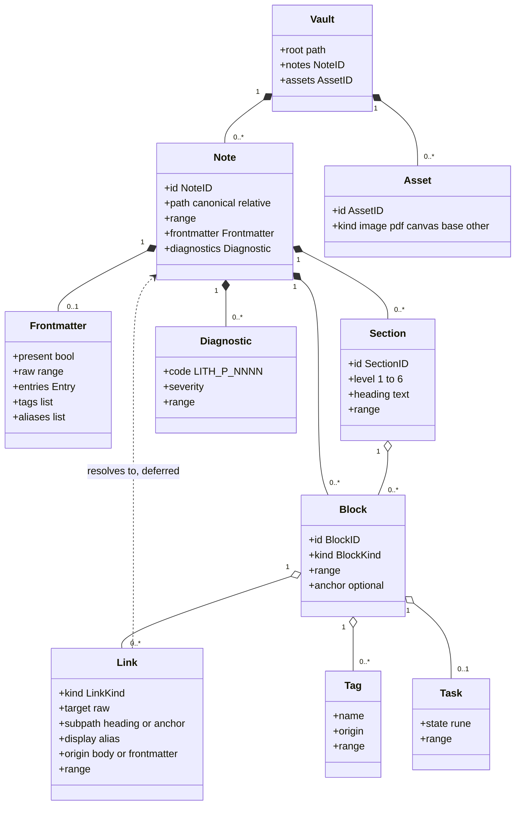
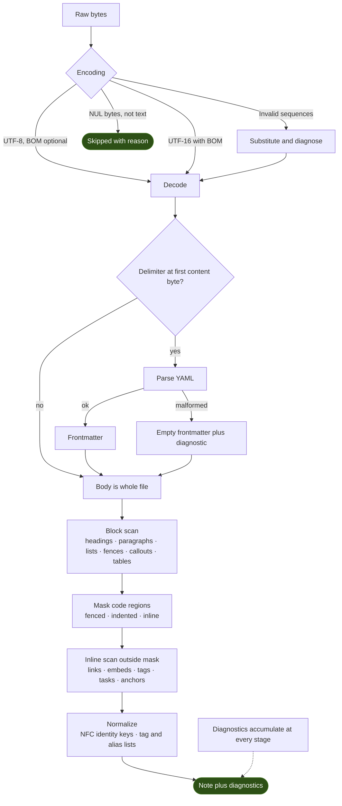
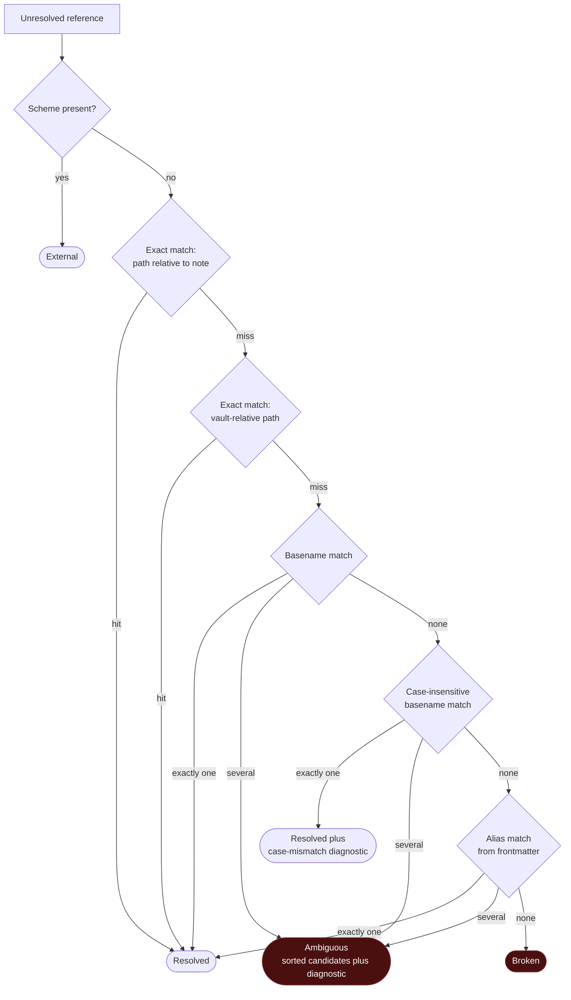

# RFC-0002: Domain Model & Vault AST Representation

## Summary

Defines the entities Lith understands a vault to contain, how those entities are identified and addressed, and the rules by which raw bytes become them.

Three decisions carry most of the weight:

1. **Lith never re-serializes a note.** The AST carries byte ranges into the original file; any future mutation is a splice of those ranges. Lith cannot reformat a user's file, because it has no code path that writes one out.
2. **Parsing is total.** No input aborts a parse. Malformed frontmatter, invalid UTF-8, and a NUL byte in the middle of a note all produce a `Note` plus diagnostics — never a failed index.
3. **Resolution is separate from parsing, and never guesses.** A link is parsed as an unresolved reference. Resolution is a deterministic function over the note set returning *resolved*, *ambiguous with a sorted candidate list*, *broken*, or *external* — never an arbitrary pick.

## Motivation

Every later subsystem consumes this model. If it is wrong, RFC-0003 stores the wrong thing, RFC-0004 incrementally maintains the wrong thing, and every capability answers questions about the wrong thing.

Three failure modes justify the specific shape proposed here:

- **Reformatting.** A model that round-trips through a serializer will eventually normalize the user's whitespace, reorder frontmatter keys, or rewrite line endings. For a tool whose first principle is that Markdown is the source of truth, silently rewriting a file is the worst available bug. Byte-range addressing removes the capability rather than policing it.
- **Fragile ingestion.** A parser that returns an error on malformed YAML makes one bad file poison an index of fifty thousand. Total parsing plus diagnostics keeps a vault indexable in the state users actually keep it in.
- **Silent link guessing.** When two notes share a basename, picking one is a coin flip that surfaces months later as a wrong answer with no trace. Ambiguity must be a first-class result.

## Goals

- Define the entity set, its relationships, and its identity scheme.
- Define byte-level addressing and the round-trip guarantee that follows from it.
- Define the parse pipeline, including encoding handling and diagnostics.
- Define frontmatter, link, embed, tag, and task semantics precisely enough to write goldens against.
- Define deterministic link resolution, including ambiguity.
- Define how unrecognized syntax is preserved without being interpreted.

## Non-Goals

- Database schema, persistence, or rebuild mechanics — RFC-0003.
- Graph construction, backlink indexes, incremental re-parse, or change detection — RFC-0004.
- Transaction semantics and job orchestration — RFC-0005.
- Query languages, ranking, or search — later RFCs.
- Interpreting plugin syntax. Dataview queries, Canvas payloads, and Bases definitions are preserved, not evaluated.
- Go type declarations. This RFC specifies the model; naming and package layout are implementation.

## Background

Terms used normatively — *Vault*, *Note*, *Section*, *Block*, *Derived State* — are defined in [docs/glossary.md](../docs/glossary.md). Architectural context, including the layer contracts this RFC sits inside, is [RFC-0001](0001-project-vision.md).

Every rule below with a testable consequence names the corresponding edge case from the [test vault specification](../docs/testing/test-vault-spec.md) as `EC-*`.

## Proposed Design

### 1. Entity Model

Deliberately **not** modelled in M1:

- **Inline spans as entities.** Emphasis, inline code, and plain text are not nodes. Links, tags, and tasks carry their own byte ranges; nothing else needs addressing yet. An inline tree costs memory on every note to serve no current capability.
- **The link graph.** `Link` records an unresolved reference. Edges, backlinks, and traversal belong to RFC-0004.
- **Canvas and Bases as notes.** They are `Asset`s with a declared kind. Their internal structure is out of scope until a capability requires it.

### 2. Identity & Addressing

| Entity | Identity | Durable? |
| ------ | -------- | -------- |
| **Note** | `NoteID` — canonicalized vault-relative path | Until renamed |
| **Section** | `NoteID` + heading path, with an occurrence index when headings repeat | Until headings change |
| **Block, explicit** | `NoteID` + `^anchor` | Yes |
| **Block, implicit** | `NoteID` + byte offset | **No** |
| **Asset** | Path identity, as for a note | Until renamed |

**Path canonicalization.** Forward slashes; relative to vault root; `.` and `..` resolved; Unicode normalized to **NFC** for identity. Raw bytes are retained separately for filesystem I/O, because the on-disk name may be NFD (`EC-FS-005`) and the filesystem is the authority on how to open it. Two paths differing only by Unicode normal form are **the same note** (`EC-FS-004`, `EC-FS-005`).

**Case is preserved, never folded, in identity.** A case-folded key is maintained *alongside* identity for lookup and collision detection. On a case-insensitive volume, two paths differing only by case are one file; on a case-sensitive volume they are two. Identity stays byte-honest, and the case-folded index makes the collision detectable (`EC-FS-X-001`, `EC-LNK-014`).

**Renames are delete + create in M1.** Rename detection needs content hashing across a change window, which belongs to RFC-0004. Until then a rename is observed as a removal and an addition, and any consumer needing continuity across renames must say so explicitly.

**Implicit block identity is not durable, and MUST NOT be persisted as a cross-note reference target.** A byte offset changes when anything above it changes; storing one as a link target creates a reference that silently drifts to point at different content. Only `^anchor` blocks are legitimate reference targets ([C-10](#c-10-implicit-block-identity-is-not-durable)).

**Ranges are half-open byte ranges, absolute within the file.** Not line and column: line/column is line-ending dependent, so every `EC-ENC-*` case would produce different coordinates for identical content. A BOM, where present, occupies leading bytes like any other content.

### 3. The Byte Fidelity Rule

> Lith never re-serializes a note. Every mutation is a splice of byte ranges into the original file.

Consequences, all intended:

- Unknown and future syntax survives untouched, because nothing regenerates it.
- Line endings, indentation, and frontmatter key order are preserved by construction (`EC-ENC-001` … `EC-ENC-004`).
- An edit touching one block cannot alter a byte elsewhere in the file, which makes a transactional write reviewable as a diff (RFC-0005).
- The parser package exposes no note-writing function at all. The guarantee is structural, not a convention ([C-3](#c-3-no-re-serialization-path)).

The corresponding round-trip property: reassembling a note's top-level ranges in order, including the gaps between them, reproduces the file byte for byte ([C-2](#c-2-byte-fidelity)).

### 4. Parse Pipeline

**Totality.** Every input yields either a `Note` (possibly with diagnostics) or an explicit `Skipped(reason)`. There is no third outcome, and no stage may abort the pipeline ([C-1](#c-1-total-parsing)).

**Encoding rules:**

| Input | Behaviour | Case |
| ----- | --------- | ---- |
| UTF-8, no BOM | Parse | `EC-ENC-001` |
| UTF-8 with BOM | Parse; BOM is leading bytes, excluded from frontmatter detection | `EC-ENC-005` |
| UTF-16 with BOM | Decode to UTF-8 internally; ranges refer to **original** bytes | `EC-ENC-006` |
| Invalid UTF-8 sequence | Substitute U+FFFD, diagnose, continue | `EC-ENC-007` |
| Zero-byte file | Valid empty note | `EC-ENC-010` |
| NUL byte present | `Skipped(binary)` plus diagnostic | `EC-ENC-011` |
| Mixed line endings | Parse; endings preserved verbatim | `EC-ENC-003` |

Because ranges always refer to original bytes, a decoded UTF-16 note stays spliceable without re-encoding the whole file.

### 5. Frontmatter

**Delimitation.** Frontmatter exists only when the first content byte (after an optional BOM) begins a delimiter line, terminated by the next delimiter line. Anything else is body — including a delimiter preceded by a blank line (`EC-FM-012`). This makes a delimiter inside a fenced code block a non-issue by construction (`EC-FM-011`).

**Failure isolation.** Malformed YAML yields empty frontmatter plus a diagnostic; the body parses normally (`EC-FM-003`, `EC-FM-010`). Frontmatter is metadata about a note, not a precondition for having one ([C-7](#c-7-frontmatter-failure-isolation)).

**Values.** Every entry retains its raw byte range alongside its parsed value. No silent coercion:

- `tags` accepts a list, a bare string, or a comma-separated string; all normalize to a list, with the original form retained (`EC-FM-005`).
- `aliases` behaves identically (`EC-FM-006`).
- Dates are **not** coerced. An unambiguous ISO 8601 value additionally gets a typed date view; anything else stays a string with a diagnostic (`EC-FM-008`).
- Duplicate keys: last occurrence wins, diagnostic emitted, all occurrences' ranges retained (`EC-FM-004`).
- Unknown keys are preserved verbatim. Lith has no frontmatter schema and does not want one — the user's vocabulary is the user's.

### 6. Links & Embeds

**Kinds:** wiki link, wiki embed, Markdown link, Markdown image, external link.

**Components:** raw target, optional subpath (heading or anchor), optional display alias, origin (`body` | `frontmatter`), byte range. Optional components are absent-not-empty; an empty alias is malformed, not empty, and is diagnosed.

**Code isolation.** Fenced code, indented code, and inline code are masked before the inline scan. A wiki link inside any of them is text (`EC-LNK-008`, `EC-LNK-009`, `EC-CNT-016`). Escaped brackets are text (`EC-LNK-010`). This is the most common source of phantom edges in naïve implementations, so it is asserted ([C-6](#c-6-code-region-isolation)).

**Resolution** runs after parsing, over the current note set:

Rules that make this reviewable:

- The order is fixed and total. Same note set plus same reference always yields the same outcome ([C-8](#c-8-deterministic-link-resolution)).
- **Ambiguity is a result, not an error to be papered over.** Candidates are returned sorted by `NoteID`; no candidate is chosen (`EC-LNK-013`).
- A case-insensitive hit resolves but is diagnosed, because it breaks the day the vault moves to a case-sensitive volume (`EC-LNK-014`).
- Subpaths resolve within the target note *after* the note resolves. A valid note with a missing heading or anchor is `Resolved` with a subpath diagnostic — not `Broken`.
- Links inside frontmatter values are recognized and carry `origin: frontmatter`, so a capability can include or exclude them deliberately (`EC-LNK-015`).
- Self-links and cycles are ordinary resolutions. Cycle handling is a traversal concern, not a parsing one (`EC-LNK-012`, `EC-LNK-017`).

### 7. Tags

Body tags and frontmatter tags are the same entity with different `origin`. Nested tags are stored whole; the hierarchy is derived, not a separate entity. Case is preserved with a case-folded lookup key, matching the note identity approach. A token that is entirely numeric is not a tag. Tags inside code regions are not tags, by the same masking rule as links.

### 8. Tasks

A list item whose content begins with a single-character bracketed marker is a task. The character is retained raw as the state, with a typed view of `Open` (space), `Done` (`x`, `X`), or `Other(rune)`.

Lith hardcodes no plugin's task vocabulary. Alternative markers are preserved as `Other`, so a Tasks-capability RFC can interpret them later without a parser change (`EC-CNT-008`).

### 9. Sections & Blocks

**Sections** derive from ATX headings. A section spans from its heading to the next heading of equal or lower level. Setext headings are recognized. Duplicate headings within a note are disambiguated by occurrence index in the `SectionID`.

**Blocks** are the smallest addressable unit, per the glossary: paragraph, list item, blockquote, code fence, callout, table, thematic break, HTML block, and heading. Every block carries a kind, a range, and an optional anchor.

Unrecognized or plugin-specific constructs — Dataview queries, Mermaid, LaTeX, Bases fragments — are blocks of kind `Opaque` with a subtype hint. Content is preserved exactly and not interpreted (`EC-CNT-009`, `EC-CNT-010`). This is what makes the model survive contact with a real vault: the long tail of syntax is *carried*, not *understood*.

### 10. Diagnostics

Codes are stable, structured, and never localized: `LITH-P-NNNN`, where `P` denotes the parsing domain. Each diagnostic carries a code, a severity (`Info` | `Warning` | `Error`), and a byte range.

`Error` severity means "this note is degraded", never "indexing failed". Because diagnostics appear in goldens, their codes are part of the public contract and are versioned with the same discipline as conformance assertion ids — human-readable text is not, and must never be asserted on.

## Alternatives Considered

1. **Full lossless AST with a serializer.** Rejected: it makes reformatting a user's vault a one-line bug, and forces the model to represent syntax it has no reason to understand. Byte splicing gives fidelity without comprehension.
2. **Line/column addressing.** Rejected: line/column is line-ending and encoding dependent, so identical content in CRLF and LF forms produces different coordinates — every `EC-ENC-*` case becomes a false failure.
3. **Content-hash note identity.** Rejected for M1: it makes identity survive renames, but every edit changes identity, which is worse. Revisit alongside rename detection in RFC-0004.
4. **Resolving links during parsing.** Rejected: it makes parsing depend on the whole note set, so one file cannot be parsed in isolation — defeating incremental re-parse (RFC-0004) before it is designed.
5. **Erroring on malformed input.** Rejected: one broken file must not cost a whole index. Real vaults are messy by nature.
6. **Modelling inline spans.** Rejected on YAGNI grounds: no current capability needs a full inline tree, and it is the largest per-note memory cost in the model.

## Risks

| Risk | Mitigation |
| ---- | ---------- |
| **Byte ranges invalidated by concurrent external edits** | Ranges are valid only against the exact bytes parsed; RFC-0005 validates content identity before applying a splice |
| **Obsidian syntax evolves** | `Opaque` blocks preserve unknown constructs; new syntax is additive to the inline scan |
| **Ambiguous links surface as noise on large vaults** | Ambiguity is a diagnostic, not a failure; the Metadata capability can report or suppress it |
| **NFC/NFD divergence between filesystem and index** | Identity is NFC; raw bytes retained for I/O; asserted by [C-5](#c-5-path-identity-normalization) |
| **Diagnostic code sprawl** | Codes are allocated in this RFC's domain range and reviewed like assertion ids |
| **Model over-fits Obsidian** | Wiki links and anchors are optional constructs; a plain CommonMark vault parses with an empty link set |

## Migration

None. No implementation exists.

## Conformance

### C-1: Total parsing
**Assertion:** Parsing MUST NOT panic, abort, or fail for any input. Every input MUST yield a `Note` with diagnostics, or an explicit `Skipped(reason)`.
**Verification:** Fuzz test over the malformed generator family plus every committed corpus file; any panic or unhandled error fails. Asserted against `EC-ENC-*`, `EC-FM-003`, `EC-FM-010`.
**Milestone:** M1-B

### C-2: Byte fidelity
**Assertion:** Reassembling a note's top-level ranges in order, including inter-node gaps, MUST reproduce the original file byte for byte.
**Verification:** Property test over the whole corpus and over generated vaults — parse, reassemble, compare bytes. Includes all `EC-ENC-*` cases.
**Milestone:** M1-B

### C-3: No re-serialization path
**Assertion:** The parser package MUST NOT expose any function that writes a note. All mutation MUST be expressed as byte-range splices.
**Verification:** Static check over the package's exported surface, plus an import-boundary check that filesystem write primitives are absent from the parser package. Complements [RFC-0001/C-3](0001-project-vision.md#c-3-single-write-path).
**Milestone:** M1-B

### C-4: Parse determinism
**Assertion:** Identical bytes MUST produce an identical AST and an identical diagnostic sequence, independent of locale, timezone, environment, filesystem, or processing order.
**Verification:** Golden tests executed twice per run under differing `LANG`/`TZ` and differing file iteration order; output must match byte for byte.
**Milestone:** M1-B

### C-5: Path identity normalization
**Assertion:** Paths differing only by Unicode normal form MUST map to the same `NoteID`. Case MUST NOT be folded into identity.
**Verification:** Test over `EC-FS-004` and `EC-FS-005` asserting identity equality across NFC/NFD, and identity inequality for case-differing paths on a case-sensitive volume.
**Milestone:** M1-B

### C-6: Code region isolation
**Assertion:** Links, embeds, tags, and tasks inside fenced code, indented code, or inline code MUST NOT be recognized. Escaped bracket sequences MUST NOT produce links.
**Verification:** Golden tests over `EC-LNK-008`, `EC-LNK-009`, `EC-LNK-010`, `EC-CNT-016`, `EC-CNT-010`; each asserts an empty link and tag set for the masked regions.
**Milestone:** M1-B

### C-7: Frontmatter failure isolation
**Assertion:** Malformed, duplicated, or unparseable frontmatter MUST NOT prevent the body from parsing, and MUST NOT suppress body links, tags, or tasks.
**Verification:** Golden tests over `EC-FM-003`, `EC-FM-004`, `EC-FM-010`, `EC-FM-012` asserting a complete body AST alongside the expected diagnostic codes.
**Milestone:** M1-B

### C-8: Deterministic link resolution
**Assertion:** Resolution MUST follow the fixed order specified in §6 and MUST return `Ambiguous` with a sorted candidate list rather than selecting a candidate. Identical note sets MUST produce identical outcomes.
**Verification:** Golden tests over `EC-LNK-011` … `EC-LNK-016`, executed twice per run with shuffled note insertion order; results must match.
**Milestone:** M1-B

### C-9: Encoding robustness
**Assertion:** Implementations MUST handle BOM, CRLF, lone CR, mixed line endings, invalid UTF-8, zero-byte files, and NUL-containing files exactly as tabulated in §4.
**Verification:** Golden tests over `EC-ENC-001` … `EC-ENC-013`, one assertion per row of the encoding table.
**Milestone:** M1-B

### C-10: Implicit block identity is not durable
**Assertion:** Offset-derived block identity MUST NOT be persisted as a cross-note reference target. Only anchored blocks are valid reference targets.
**Verification:** Schema/static check that reference targets carry an explicit anchor, plus a test asserting that editing a note's head does not change any durable block reference within it.
**Milestone:** M1-B

## Open Questions

- [ ] Does alias resolution outrank case-insensitive basename matching? Current order says no. *Revisit when the Metadata capability is catalogued; [C-8](#c-8-deterministic-link-resolution) holds under either order provided the order is fixed.*
- [ ] Are Canvas and Bases files promoted from `Asset` to first-class parsed entities? *Deferred to the milestone that catalogues those capabilities.*
- [ ] Should `Section` ranges include or exclude trailing blank lines before the next heading? *Affects goldens only; decide before the corpus is committed.*
- [ ] Diagnostic code number allocation policy across RFC domains. *Non-blocking; the `LITH-P-` prefix is reserved here.*

## Future Work

- **RFC-0003** — Storage Engine & State Rebuilds *(next: persistence of this model)*
- **RFC-0005** — Background Worker & Job Engine
- **RFC-0004** — Indexing & Link Graph Engine, which consumes unresolved links and produces the graph
- *Future:* rename detection via content identity; Canvas and Bases domain models; anchor generation during transactional edits

## Acceptance Checklist

- [x] Every `Conformance` assertion has a Verification method and an owning milestone — all ten
- [x] No assertion depends on unresolved *Open Questions* — each open question below states why it does not block an assertion
- [x] *Non-Goals* are explicit
- [x] At least one diagram covering the primary data flow, component topology, or state lifecycle — three: entity model, parse pipeline, link resolution
- [x] Every diagram validated as Mermaid by a parser, not by eye — 3/3 valid
- [x] All domain terms used normatively exist in [docs/glossary.md](../docs/glossary.md) — *Asset*, *Diagnostic*, *Opaque Block* are added in stack 3 ([RFC-0001](0001-project-vision.md)), which merges before this PR; the glossary is a single shared file and per-branch edits would force a rebase of published history
- [x] No conflict with [PROJECT_PRINCIPLES.md](../PROJECT_PRINCIPLES.md)
- [x] **N/A** — this RFC names no capability. It specifies parsing infrastructure; the `subsystem` frontmatter values are not capabilities. See [docs/reference/capability-catalog.md](../docs/reference/capability-catalog.md)
- [x] Every `EC-*` case referenced exists in [docs/testing/test-vault-spec.md](../docs/testing/test-vault-spec.md)
- [x] [rfcs/index.md](index.md) and [ARCHITECTURE.md](../ARCHITECTURE.md) rows updated — corrected on `main`
- [x] Reviewed and approved by maintainers

## References

### Internal
- [RFC-0001: Project Vision & Strategic Architecture](0001-project-vision.md)
- [PROJECT_PRINCIPLES.md](../PROJECT_PRINCIPLES.md)
- [docs/glossary.md](../docs/glossary.md)
- [docs/testing/test-vault-spec.md](../docs/testing/test-vault-spec.md)
- [rfcs/README.md](README.md)

### External
- [Obsidian Flavored Markdown Specification](https://help.obsidian.md/Editing+and+formatting/Obsidian+Flavored+Markdown)
- [CommonMark Specification](https://spec.commonmark.org/)
- [Unicode Standard Annex #15 — Normalization Forms](https://unicode.org/reports/tr15/)
- [YAML 1.2 Specification](https://yaml.org/spec/1.2.2/)
- [RFC 2119 — Key words for use in RFCs](https://www.rfc-editor.org/rfc/rfc2119)
