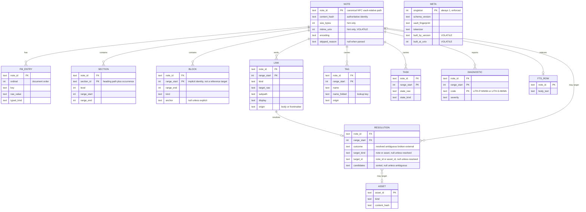
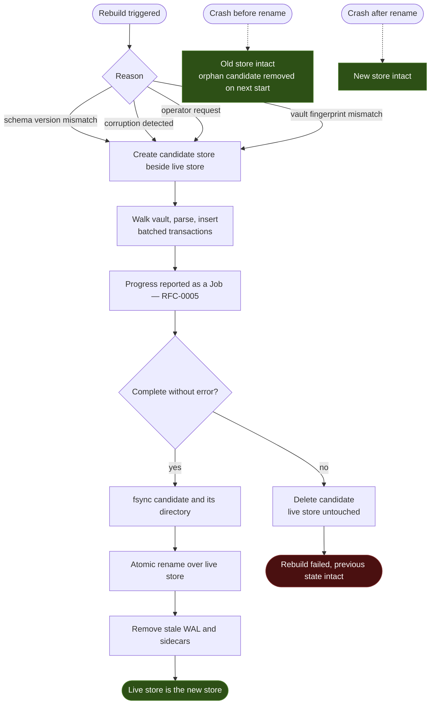
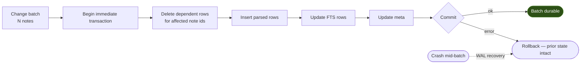

# RFC-0003: Storage Engine & State Rebuilds

## Summary

Specifies how the domain model of [RFC-0002](0002-domain-model.md) is persisted, and turns [RFC-0001/C-2](0001-project-vision.md#c-2-rebuild-determinism) — *rebuild determinism* — from a claim into a procedure a machine can check.

Four decisions carry it:

1. **"Logically identical" means an identical canonical dump.** A SQLite file's bytes are not reproducible — page layout, freelists, and rowid allocation depend on insertion order. Determinism is therefore asserted over an ordered, normalized projection of durable state, and every column is classified as **durable** or **volatile** with no third option.
2. **There are no migrations.** Because all state is derived, a schema version mismatch is resolved by deleting the store and rebuilding it. No `ALTER TABLE`, no migration scripts, no half-migrated database. This is the concrete payoff of Principle 2.
3. **Rebuild is an atomic swap.** The new store is built beside the old one and renamed over it. A crash at any instant leaves either the complete old store or the complete new one, never a mixture.
4. **The store never lives inside the vault.** Derived state written into the vault would be indexed as vault content, and would pollute the user's canonical data with our cache.

## Motivation

Principle 2 says SQLite is disposable. Every project that has claimed something similar eventually discovers that its cache holds one fact that cannot be recomputed — a manually assigned id, a first-seen timestamp, a user preference — and from that moment the cache is authoritative and the principle is decoration.

The defence is not discipline. It is a test that fails when the property breaks. That test needs a definition of equality stable across insertion order, page layout, and SQLite version, which is what most of this RFC is about.

A second motivation is the cost of *not* having migrations. Migration machinery is where long-lived local-first tools accumulate their worst bugs: partially applied schema changes, version skew between binary and file, and recovery paths first exercised on a user's machine. Disposability lets us delete that entire category, and the price — a rebuild — is a cost we must already pay correctly for other reasons.

## Goals

- Specify the storage engine and the logical schema holding the RFC-0002 model.
- Define *logically identical* precisely enough to compute and compare.
- Define the durable/volatile column classification and its enforcement.
- Specify rebuild, including atomicity, crash behaviour, and progress.
- Specify the write path, transaction boundaries, and concurrency model.
- Specify store placement and the vault-isolation rule.
- Specify content identity, so change detection cannot regress to `mtime` + size.

## Non-Goals

- Query languages, ranking functions, or search semantics beyond the storage primitives they require — later RFCs.
- Graph construction, backlink materialization, and incremental re-index scheduling — RFC-0004.
- Transaction *coordination* across subsystems, job orchestration, and retry — RFC-0005. This RFC provides the atomic-commit primitive those rely on.
- Vector or embedding storage. Out of scope for the MVP entirely, per [RFC-0001 §4](0001-project-vision.md).
- Concrete DDL. Logical tables and key structure are specified; column types and index tuning are implementation.
- Multi-vault and multi-tenant storage layout. The schema must not preclude it; M1 does not build it.

## Background

Consumes the domain model and identity scheme of [RFC-0002](0002-domain-model.md). Sits in the *Derived State Store* layer of [RFC-0001 §1](0001-project-vision.md), whose contract forbids holding any state not reconstructible from the vault.

Edge cases referenced as `EC-*` are defined in the [test vault specification](../docs/testing/test-vault-spec.md).

## Proposed Design

### 1. Engine Selection

**SQLite**, in WAL mode, one database file per workspace.

It is the only widely deployed engine satisfying all three deployment models of [RFC-0001 §6](0001-project-vision.md) simultaneously: it embeds in a library with no server, runs under a daemon, and works in a sidecar container. It is ACID, ships full-text search (FTS5) without a plugin, and is the most heavily tested piece of software we could put under a disposable cache.

Rejected alternatives are recorded in *Alternatives Considered*.

### 2. Logical Schema

Specified as logical tables and key structure. Column types, index selection, and physical layout are implementation.

**Natural keys, not surrogate rowids.** `note_id` is the canonical path from RFC-0002 §2; child rows key on `(note_id, range_start)`. No autoincrement integer is ever referenced across tables.

This is deliberate and it costs storage. Autoincrement ids are assigned in insertion order, so a full rebuild that walks the filesystem in a different order produces different ids — any dump containing them differs, making determinism unassertable without a renumbering pass. Natural keys make the canonical dump fall out of the schema instead of being reconstructed by tooling. Storage overhead is measured at benchmark tier M before this is revisited.

**Note body text is stored**, because FTS5 needs it and the filesystem is not a table. This duplicates vault content into the store — accepted, and precisely why the store is never backed up and never synced. A *contentless* FTS5 table would avoid the duplication, but it cannot return snippets or re-rank without re-reading the source file for every hit, which trades a bounded disk cost for an unbounded I/O cost on the query path. Revisit if store size becomes the binding constraint at benchmark tier L.

**Assets are addressable targets, not orphans.** An `ASSET` row carries path identity exactly as a note does, and has no foreign key to `NOTE` because an asset belongs to the vault rather than to any note. It exists in the schema because a resolution can *target* one: `![[diagram.png]]` resolves to an asset, not a note. `RESOLUTION` therefore carries `target_kind` alongside `target_id`, and a resolution pointing at an asset is `Resolved` rather than `Broken`. Asset *contents* remain uninterpreted, per [RFC-0002 §1](0002-domain-model.md).

**`META` holds exactly one row**, enforced by a constant primary key. It is a singleton by construction rather than by convention, so a second row is a schema violation rather than a silent ambiguity about which row is authoritative.

**Skipped files occupy a `NOTE` row** carrying `skipped_reason` and a content hash, rather than being absent. A skipped file that vanished from the store would be re-examined on every scan, and its skip would not survive into the canonical dump — making two stores with identical vaults compare unequal depending on whether a skip had been observed yet.

### 3. Durable vs Volatile

Every column is classified. There is no unclassified column, and the classification is part of the schema definition rather than a convention.

| Class | Meaning | Examples |
| ----- | ------- | -------- |
| **Durable** | Part of logical state. Included in the canonical dump. Recomputable from the vault. | `note_id`, `content_hash`, every parsed structure, resolution outcomes |
| **Volatile** | Excluded from the canonical dump. Must not affect any query answer. | `mtime_unix`, `built_at_unix`, `built_by_version`, physical rowids, WAL state |

Two rules make the classification meaningful:

1. **A volatile column may never change a query answer.** If it can, it is durable and belongs in the dump — or it is a fact the vault cannot reproduce, which violates the layer contract. Enforced by [C-3](#c-3-volatile-independence): perturb every volatile value, re-run the full query suite, require identical results.
2. **Adding a column requires classifying it.** An unclassified column fails the schema-classification check in CI ([C-2](#c-2-total-column-classification)).

`mtime_unix` is the instructive case. It is stored, because it is a cheap change-detection *hint*. It is volatile, because two machines indexing the same vault legitimately disagree about it. And it is never authoritative, because `EC-DYN-002` — identical `mtime`, identical size, different content — is a real scenario that a stat-only implementation passes in testing and fails in production ([C-7](#c-7-content-hash-authority)).

### 4. Canonical Dump

The unit of comparison for rebuild determinism.

**Definition.** For each durable table, in a fixed table order: all rows, projected to durable columns only, sorted by the table's natural key, serialized in a fixed line-oriented encoding with an explicit `NULL` representation and no floating-point values. The dump's SHA-256 is the state's logical identity.

**Table order is ASCII-ascending by table name**, and column order within a table is ASCII-ascending by column name. Leaving this to the implementation would let two conformant implementations produce different dumps for identical state, which would silently void [C-1](#c-1-rebuild-determinism) — the assertion the rest of this RFC exists to make checkable. Adding a table therefore never reorders existing ones, and the ordering rule is fixed here rather than pinned in code.

Requirements:

- **Total ordering.** Every table's natural key must be a total order. A dump with a tie is not a dump ([C-8](#c-8-total-ordering)).
- **No physical artefacts.** No rowids, no page counts, no `sqlite_sequence`, no `PRAGMA` output.
- **No environment.** No paths outside the vault-relative namespace, no hostname, no timezone-dependent rendering, no locale-dependent collation — collation is byte-wise over NFC-normalized text.
- **Stable across SQLite versions.** The dump is produced by our projection, not by `.dump`, so an engine upgrade that changes physical layout does not change logical identity.
- **FTS coverage is source text only.** The dump includes the body text the full-text index derives from; it does **not** include the index's internal structure. Including it would make the dump engine-dependent — the very property the previous rule protects. Tokenizer drift stays detectable because the tokenizer is pinned in `meta`, and changing it is a schema version change and therefore a rebuild ([§8](#8-full-text-index)).

The dump is also the debugging artefact: when a rebuild diverges, the diff names the table, the key, and the column.

### 5. Rebuild

**The live store is never mutated during a rebuild.** Queries continue to be served from it until the swap. There is no window in which the system is half-rebuilt and answering questions from partial state ([C-5](#c-5-atomic-rebuild)).

**Migrations do not exist.** A schema version mismatch triggers the flow above. No `ALTER TABLE`, no versioned migration scripts, no downgrade path. The store carries `schema_version`; if it is not exactly the version the binary expects — older *or* newer — the store is rebuilt ([C-4](#c-4-no-migration-path)).

Rebuild cost is real and bounded by benchmark tier L. It is a Job (RFC-0005) so it is cancellable, resumable at batch granularity, and observable — not a blocking startup stall.

### 6. Write Path & Concurrency

- **A batch is atomic.** All notes in a batch commit or none do. A partially indexed batch is not an observable state ([C-9](#c-9-batch-atomicity)).
- **Per-note replacement is delete-then-insert**, not in-place update. The parse result is the whole truth about a note; merging a partial update into existing rows is how stale children survive a re-index.
- **One writer.** The owning process holds an exclusive lock recorded beside the store. Other processes may open read-only. A CLI invocation against a daemon-owned workspace queries the daemon rather than opening the file for writing.
- **WAL mode**, with checkpointing on a schedule owned by RFC-0005. Readers never block the writer.
- **The storage layer has no vault write path.** It reads the vault during rebuild and never writes to it ([C-10](#c-10-no-vault-write-path), complementing [RFC-0001/C-3](0001-project-vision.md#c-3-single-write-path)).

### 7. Store Placement

The store lives outside the vault, in a per-workspace directory under the platform's standard data location, keyed by a hash of the canonical vault path.

Writing derived state inside the vault would mean the indexer indexes its own cache, the user's sync tool replicates a database that is explicitly disposable, and any file emitted by tooling becomes indistinguishable from a note. The rule is asserted, not merely recommended ([C-6](#c-6-vault-isolation)).

The `meta` table records a **vault fingerprint** — the canonical vault root path and its normalization form. A store opened against a different vault is not adopted; it is rebuilt.

### 8. Full-Text Index

FTS5 over note body text, maintained inside the same transaction as the rows it derives from — never as a deferred pass, which is how an FTS index drifts from its source.

**Deterministic ordering is a storage obligation.** FTS5 scores are floating-point and ties are common on small corpora. Every result ordering terminates in `note_id` as a final sort key. Ordering by rowid, by insertion order, or by an unstable score alone is prohibited — this is where [RFC-0001/C-7](0001-project-vision.md#c-7-deterministic-core-search) is either satisfied or quietly lost ([C-8](#c-8-total-ordering)).

Tokenization is fixed and recorded in `meta`, because changing a tokenizer changes results. A tokenizer change is a schema version change, and therefore a rebuild.

### 9. Diagnostics

Storage-domain diagnostics use `LITH-S-NNNN`, parallel to the `LITH-P-` parsing domain of RFC-0002. Codes are stable and part of the public contract; message text is not.

Corruption detected on open is a diagnostic plus a rebuild, never a hard failure. A disposable store has no failure mode that justifies refusing to start.

## Alternatives Considered

1. **Embedded key-value store (BoltDB, Badger, Pebble).** Rejected: no full-text search and no relational queries, so the graph and search layers would hand-roll indexes that SQLite already provides and tests better than we would.
2. **DuckDB.** Rejected: excellent for analytical scans, heavier for the point lookups and small transactional writes that dominate incremental indexing, and a much smaller deployment record in embedded local-first tools.
3. **Custom on-disk format.** Rejected outright. Writing a durable storage format is a multi-year project with a long tail of crash-recovery bugs, in service of a cache we are willing to delete.
4. **Physical byte comparison for rebuild determinism.** Rejected because it is impossible: rowid allocation, page splits, freelist reuse, and vacuum state all depend on insertion order. Requiring byte equality would force us to weaken the assertion until it meant nothing.
5. **Integer surrogate keys.** Rejected for M1: order-dependent id assignment makes the canonical dump non-deterministic without a renumbering pass, adding a mandatory step to the most important test in the project. Revisit if tier-M benchmarks show the storage overhead matters.
6. **Conventional schema migrations.** Rejected: migrations exist to preserve data that cannot be recomputed. All of ours can be. Keeping migration machinery would import that category's bugs for no benefit.
7. **Storing the database inside the vault.** Rejected: self-indexing, sync amplification, and contamination of the canonical source with derived state.

## Risks

| Risk | Mitigation |
| ---- | ---------- |
| **Rebuild cost on very large vaults** | Rebuild is a cancellable, resumable Job with progress; the live store keeps serving until swap; bounded by benchmark tier L |
| **Natural-key storage overhead** | Measured at tier M; surrogate keys revisited only with a determinism-preserving renumbering design |
| **A "harmless" unrecomputable column creeps in** | Total column classification ([C-2](#c-2-total-column-classification)) plus volatile independence ([C-3](#c-3-volatile-independence)) |
| **FTS drift from source rows** | FTS updated in the same transaction; rebuild determinism covers FTS source content |
| **SQLite version differences across platforms** | Canonical dump is our projection, not `.dump`; tokenizer pinned in `meta` |
| **Concurrent access from CLI and daemon** | Single-writer lock; CLI routes through the daemon when a workspace is owned |
| **Text duplication into the store** | Accepted and documented; the store is never backed up or synced, and rebuild is always available |

## Migration

None, and none will ever exist. Schema evolution is expressed as a version bump followed by a rebuild ([C-4](#c-4-no-migration-path)).

## Conformance

### C-1: Rebuild determinism
**Assertion:** For an unchanged vault, the canonical dump after a full rebuild MUST be identical to the canonical dump before it, and identical to the dump produced by incremental indexing of the same vault.
**Verification:** Integration test over the test vault corpus — index, dump, delete store, rebuild, dump, compare SHA-256; then a third comparison against an incrementally built store. Runs on every CI build. Refines [RFC-0001/C-2](0001-project-vision.md#c-2-rebuild-determinism).
**Milestone:** M1-B

### C-2: Total column classification
**Assertion:** Every column in the schema MUST be classified `durable` or `volatile`. An unclassified column MUST fail the build.
**Verification:** CI check comparing the schema's column set against the classification manifest; any symmetric difference fails.
**Milestone:** M1-B

### C-3: Volatile independence
**Assertion:** No query answer MAY depend on a volatile column.
**Verification:** Test perturbing every volatile value — timestamps shifted, builder version altered, rows reinserted in shuffled order — then re-running the full query suite; results must be identical.
**Milestone:** M1-B

### C-4: No migration path
**Assertion:** The storage layer MUST NOT contain schema migration logic. A `schema_version` mismatch in either direction MUST trigger a full rebuild.
**Verification:** Static check that no `ALTER TABLE` or migration construct exists in the storage package, plus a test opening stores stamped with older and newer versions and asserting a rebuild in both cases.
**Milestone:** M1-B

### C-5: Atomic rebuild
**Assertion:** A rebuild MUST NOT mutate the live store. A crash at any point MUST leave either the complete previous store or the complete new store, never a mixture, and never an unreadable store.
**Verification:** Crash-injection test at each labelled point of the rebuild flow; after each, the store opens and its canonical dump matches one of the two expected dumps exactly.
**Milestone:** M1-B

### C-6: Vault isolation
**Assertion:** The storage layer MUST NOT create or write any file inside the vault root.
**Verification:** Integration test running a full index and rebuild against the corpus with the vault directory watched; any created or modified path under the vault root fails the test. Complements [C-10](#c-10-no-vault-write-path).
**Milestone:** M1-A

### C-7: Content-hash authority
**Assertion:** Change detection MUST treat the content hash as authoritative. `mtime` and size MAY be used as hints only, and MUST NOT be sufficient to conclude a file is unchanged.
**Verification:** `EC-DYN-002` scenario — identical `mtime` and size, changed content — must be detected and re-indexed.
**Milestone:** M1-B

### C-8: Total ordering
**Assertion:** Every persisted ordering and every query result ordering MUST be total, terminating in `note_id`. Ordering by rowid, insertion order, or an unstable score alone is prohibited.
**Verification:** Static check for rowid-based ordering in the storage and query packages, plus golden tests executed with shuffled insertion order requiring identical result sequences. Supports [RFC-0001/C-7](0001-project-vision.md#c-7-deterministic-core-search).
**Milestone:** M1-C

### C-9: Batch atomicity
**Assertion:** A change batch MUST commit fully or not at all. A crash mid-batch MUST leave the prior consistent state.
**Verification:** Crash-injection test during a multi-note batch; after recovery the canonical dump must equal the pre-batch dump exactly.
**Milestone:** M1-B

### C-10: No vault write path
**Assertion:** The storage package MUST NOT reference filesystem write primitives targeting the vault, and MUST expose no API that writes vault content.
**Verification:** Static check over the storage package's exported surface and import graph. Complements [RFC-0001/C-3](0001-project-vision.md#c-3-single-write-path) and [RFC-0002/C-3](0002-domain-model.md#c-3-no-re-serialization-path).
**Milestone:** M1-B

## Open Questions

- [x] ~~Does the canonical dump cover FTS index *content*, or only the source text it derives from?~~ **Resolved:** source text only, tokenizer pinned in `meta`. Covering the index would make the dump engine-dependent. Specified in [§4](#4-canonical-dump); [C-1](#c-1-rebuild-determinism) no longer depends on an open question.
- [ ] Rebuild resumability granularity — per batch, or per directory subtree? *Deferred to RFC-0005, which owns job checkpointing.*
- [x] ~~Do skipped files occupy a `note` row carrying a reason, or a separate table?~~ **Resolved:** a `NOTE` row with `skipped_reason`, specified in §2. A separate table would leave skips outside the canonical dump, making two stores over identical vaults compare unequal depending on scan history.
- [ ] Retention of diagnostics across rebuilds. Currently none — diagnostics are derived like everything else. *Confirm no capability needs diagnostic history.*

## Future Work

- **RFC-0005** — Background Worker & Job Engine *(next: owns rebuild as a job, checkpointing, and transaction coordination)*
- **RFC-0004** — Indexing & Link Graph Engine, which consumes this schema and adds graph materialization
- *Future:* multi-workspace store layout; storage-level compaction policy; optional plugin-owned tables behind the plugin boundary

## Acceptance Checklist

- [x] Every `Conformance` assertion has a Verification method and an owning milestone — all ten
- [x] No assertion depends on unresolved *Open Questions* — the FTS-coverage question that C-1 depended on is now resolved in §4; the remaining questions affect neither an assertion nor a verification
- [x] *Non-Goals* are explicit
- [x] At least one diagram covering the primary data flow, component topology, or state lifecycle — three: logical schema, rebuild swap, write path
- [x] Every diagram validated as Mermaid by a parser, not by eye — 3/3 valid
- [x] All domain terms used normatively exist in [docs/glossary.md](../docs/glossary.md) — *Canonical Dump*, *Durable Column*, *Volatile Column*, *Vault Fingerprint* are added in stack 3 ([RFC-0001](0001-project-vision.md)), which merges before this PR
- [x] No conflict with [PROJECT_PRINCIPLES.md](../PROJECT_PRINCIPLES.md)
- [x] **N/A** — this RFC names no capability. It specifies the storage subsystem; [CAP-0001 Search](../docs/reference/capability-catalog.md) names RFC-0003 as its owner, but the capability itself is catalogued there rather than defined here
- [x] Every `EC-*` case referenced exists in [docs/testing/test-vault-spec.md](../docs/testing/test-vault-spec.md)
- [x] [rfcs/index.md](index.md) and [ARCHITECTURE.md](../ARCHITECTURE.md) rows updated — corrected on `main`
- [x] Reviewed and approved by maintainers

## References

### Internal
- [RFC-0001: Project Vision & Strategic Architecture](0001-project-vision.md)
- [RFC-0002: Domain Model & Vault AST](0002-domain-model.md)
- [PROJECT_PRINCIPLES.md](../PROJECT_PRINCIPLES.md)
- [docs/glossary.md](../docs/glossary.md)
- [docs/testing/test-vault-spec.md](../docs/testing/test-vault-spec.md)
- [rfcs/README.md](README.md)

### External
- [SQLite Documentation](https://www.sqlite.org/docs.html)
- [SQLite Write-Ahead Logging](https://www.sqlite.org/wal.html)
- [SQLite FTS5](https://www.sqlite.org/fts5.html)
- [SQLite Atomic Commit](https://www.sqlite.org/atomiccommit.html)
- [RFC 2119 — Key words for use in RFCs](https://www.rfc-editor.org/rfc/rfc2119)
