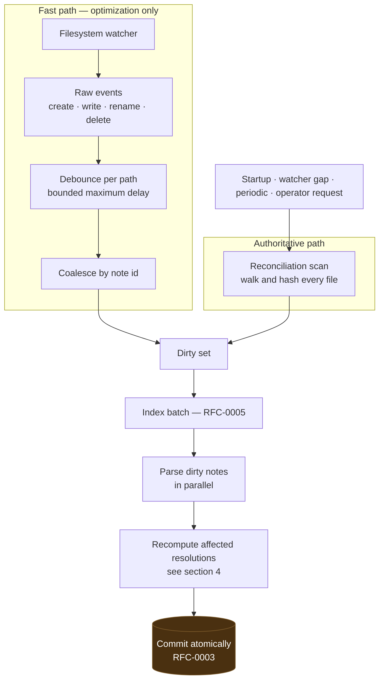
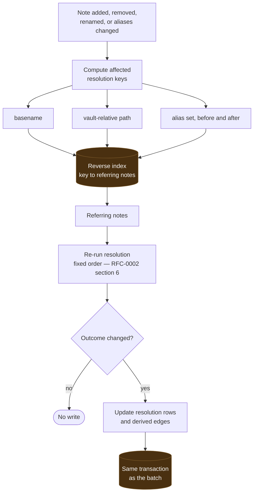
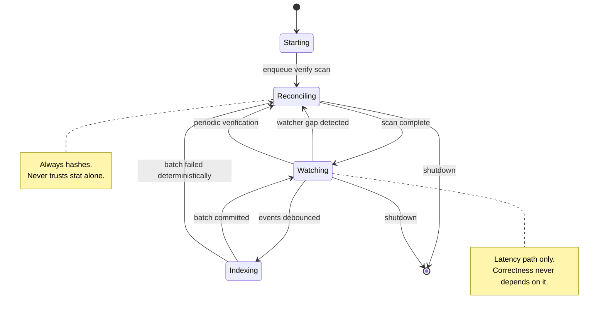

# RFC-0004: Indexing & Link Graph Engine

## Summary

Specifies how vault changes become index updates, and how the link graph is derived and kept correct incrementally.

Four decisions carry it:

1. **The filesystem watcher is a latency optimization, never a correctness mechanism.** Watchers drop events — queue overflow, network filesystems, container bind mounts, coalesced platform notifications. Correctness comes from a scan that reads and hashes. With the watcher removed entirely, the system must still converge to identical state.
2. **Convergence is the central property.** After any sequence of filesystem operations, once quiescent, the incrementally maintained state must equal the state produced by a full rebuild. Every other assertion here exists to protect that one.
3. **Link resolution is non-local, so invalidation fans out.** Creating one note can repair broken links across the vault and turn unique basename matches ambiguous. A reverse index over resolution keys makes that fan-out precise instead of guessed.
4. **A scan never concludes "unchanged" from `stat` alone.** Size and modification time order the work; the content hash decides it. This is the direct cost of [RFC-0003/C-7](0003-storage-engine.md#c-7-content-hash-authority), paid deliberately.

## Motivation

Incremental indexing is where knowledge engines go quietly wrong. The failure is never loud: the index is *mostly* right, and the one stale entry surfaces months later as an answer nobody can explain. Three mechanisms produce that outcome, and each is addressed structurally here.

**Trusting the watcher.** Every filesystem notification API drops events under load, and several drop them silently. A design whose correctness depends on receiving every event is correct only on an idle developer machine.

**Trusting `stat`.** Skipping files whose size and modification time are unchanged is the standard optimization, and it silently loses updates — `EC-DYN-002` in the [test vault specification](../docs/testing/test-vault-spec.md) is exactly this case, and it passes in testing while failing in production.

**Treating link resolution as local.** Parsing is per-file; resolution is not. An implementation that re-resolves only the changed file accumulates stale `Broken` links and stale `Ambiguous` verdicts, and no test examining one file at a time will catch it.

## Goals

- Define filesystem observation, event handling, and the reconciliation scan.
- Define the dirty set and its transitions to indexed state.
- Define debouncing bounds and event coalescing.
- Define incremental link resolution, including non-local invalidation.
- Define the derived link graph and backlink materialization.
- Define recovery from watcher gaps, directory renames, and atomic-save patterns.
- State convergence precisely enough to test.

## Non-Goals

- Parsing and link syntax — RFC-0002. This RFC consumes parse results.
- Storage schema, transactions, and the canonical dump — RFC-0003.
- Job scheduling, cancellation, retry, and the write path to the vault — RFC-0005. This RFC produces the dirty set that engine schedules.
- Graph query languages, traversal APIs, and ranking — M2 capability RFCs. This RFC materializes the graph; it does not expose it.
- Semantic or embedding-based relations. Out of scope for the MVP entirely, per [RFC-0001 §4](0001-project-vision.md).
- Multi-vault or cross-vault link resolution.

## Background

Consumes [RFC-0002](0002-domain-model.md) (parse results, unresolved links, resolution order), [RFC-0003](0003-storage-engine.md) (schema, content hashes, canonical dump), and [RFC-0005](0005-job-engine.md) (job scheduling, batching, cancellation, recovery).

This is the last of the five RFCs that gate M1 implementation. No implementation begins until all five are `Accepted`.

## Proposed Design

### 1. Change Observation

Two independent sources produce work. One is fast and unreliable; the other is slow and authoritative.

**The watcher's only job is to lower latency.** Disabling it entirely must change how fast the index catches up, never what it eventually contains ([C-2](#c-2-watcher-independence)). Any behaviour reachable only via the watcher path is a correctness bug waiting for a busy machine.

**The scan always hashes.** `stat` results order the work — likely-changed files first — but never conclude that a file is unchanged. That is the price of [RFC-0003/C-7](0003-storage-engine.md#c-7-content-hash-authority), and it is not negotiable at this layer, because the alternative loses writes in exactly the case users never suspect ([C-4](#c-4-scan-hashes-every-file)).

The scan runs as a low-priority background job so startup does not block on it, while the watcher keeps interactive latency low. On very large vaults this trades startup CPU for correctness; the trade is measured at benchmark tier L.

### 2. Event Semantics

Editors do not emit the events a naïve design expects. Three patterns matter:

| Pattern | What the watcher reports | Correct interpretation | Case |
| ------- | ------------------------ | ---------------------- | ---- |
| **Atomic save** | Create temp, rename over target, sometimes a delete | One modification of the target — never a deletion | `EC-DYN-005` |
| **Directory rename** | One event on the directory, none for children | Invalidate the entire subtree | `EC-DYN-006` |
| **Rapid burst** | Create → rename → delete within milliseconds | Coalesce to the final observable state | `EC-DYN-004` |

An atomic save misread as a delete removes a live note from the index until the next scan. This is asserted directly ([C-10](#c-10-atomic-save-handling)).

**Debouncing is bounded in both directions.** A quiet period after the last event avoids indexing a half-written file; a maximum delay ensures a continuously written file is still indexed within a stated bound rather than starved indefinitely ([C-5](#c-5-bounded-debounce)).

**The M1 values are a 200 ms quiet period and a 5 s maximum delay.** The quiet period is longer than the gap between the events an editor's atomic save produces, and shorter than a person notices. The maximum matches the cancellation bound of [RFC-0005 §3](0005-job-engine.md), so a shutdown never has to wait on a debounce that outlives it. Both are tuning values expected to move after measurement; what is fixed is that *a* maximum exists.

**Symlinks are never followed outside the vault root.** A symlink pointing outside is recorded and not traversed; a symlink inside resolves to a note already in the vault. Following an outward symlink would index arbitrary filesystem content as vault knowledge (`EC-FS-014`, [C-8](#c-8-symlink-containment)).

**Renames are a re-parse optimization, not an identity operation.** Per [RFC-0002 §2](0002-domain-model.md), identity is the path, so a rename remains delete-plus-create in the model. When a delete and a create within one batch carry the same content hash, the parse result is reused rather than recomputed. Index contents are identical either way; only the work differs.

### 3. Dirty Set

A set of `note_id`s awaiting re-index, each with a reason (`event`, `scan`, `resolution_invalidation`, `rebuild`).

Properties:

- **Idempotent membership.** Adding a `note_id` twice is one entry. A thousand saves during an editing session produce one unit of work when the batch runs.
- **Monotone until commit.** Entries leave the set only when their batch commits successfully. A cancelled or failed batch returns its entries, so nothing is lost by interruption.
- **Bounded.** The set is capped at the vault's note count by construction, since it holds identities rather than events.

### 4. Incremental Resolution — the Non-Local Problem

Parsing is per-file. Resolution is not. Consider `[[Meeting Notes]]` appearing in fifty notes:

- Creating `Meeting Notes.md` turns fifty `Broken` links into `Resolved`.
- Creating a *second* `Meeting Notes.md` in another folder turns all fifty `Resolved` into `Ambiguous`.
- Adding the alias `Meeting Notes` to an unrelated note changes resolution for every reference that previously fell through to the alias step.

None of these events touch the fifty referring files. An implementation that re-resolves only what changed is wrong in a way no per-file test detects.

**A reverse index over resolution keys** — basename, vault-relative path, alias — maps each key to the notes referring to it. When a note's presence, path, or alias set changes, the affected keys are known exactly, and only their referrers are re-resolved. This bounds the work without guessing, and it is itself derived state, rebuilt like everything else.

**Resolution updates commit in the same transaction as the parse results that triggered them** ([RFC-0003/C-9](0003-storage-engine.md#c-9-batch-atomicity)). A state in which a note exists but links pointing at it are still `Broken` is never observable.

**Alias changes are resolution changes.** Editing frontmatter in one note can alter resolution in notes that never mention it. This is the least intuitive case, and the one most likely to be missed ([C-3](#c-3-no-stale-resolutions)).

### 5. Link Graph

The graph is derived from resolutions, which are themselves derived from parse results. It is twice-removed from truth and disposable at both levels.

| Element | Derivation |
| ------- | ---------- |
| **Edge** | One `Resolved` resolution — source note, target note, link kind, origin |
| **Backlink** | The reverse direction of an edge, materialized for query performance |
| **Orphan** | A note with no inbound edges — a query, not stored state |
| **Dangling reference** | A `Broken` resolution, retained with its referring note |
| **Ambiguous reference** | An `Ambiguous` resolution with its sorted candidate list |

`Ambiguous` and `Broken` are first-class graph facts, not omissions. A vault's broken links are among the most useful things a knowledge engine can report, and discarding them at index time throws away the signal.

Backlink materialization is a performance decision with no semantic content: the same answers must be derivable by scanning edges, which is what [C-9](#c-9-graph-is-derived) checks.

Embeds produce edges distinguished by kind. Whether an embed also counts as a link for traversal is a query-layer decision, not an indexing one.

### 6. Recovery

A **watcher gap** — queue overflow, a notification error, a platform limit, a suspended process, an unsupported filesystem — is not an error to log and continue past. It invalidates the fast path's guarantees, so it forces a reconciliation scan ([C-7](#c-7-watcher-gap-recovery)).

Startup always reconciles, because the process was not running while the vault may have changed, and no evidence exists to prove otherwise.

### 7. Diagnostics

Indexing-domain diagnostics use `LITH-I-NNNN`, alongside `LITH-P-` (parsing), `LITH-S-` (storage), and `LITH-J-` (jobs). Codes are stable and part of the public contract; message text is not.

Watcher gaps, symlink refusals, and resolution ambiguity each emit a diagnostic. Ambiguity in particular is reported rather than resolved, because the correct fix belongs to the person who owns the vault.

## Alternatives Considered

1. **Trusting the watcher for correctness.** Rejected: every platform API drops events under load, some silently. Correctness would hold only on idle machines, and the failure is invisible.
2. **`stat`-only change detection.** Rejected: loses writes whenever size and modification time are preserved (`EC-DYN-002`), precisely the case no one tests by hand. Directly contradicts [RFC-0003/C-7](0003-storage-engine.md#c-7-content-hash-authority).
3. **Full re-resolution of the entire vault on every change.** Rejected: correct but quadratic. The reverse index gives the same result at bounded cost.
4. **Local-only resolution of the changed file.** Rejected: silently wrong. Stale `Broken` and `Ambiguous` verdicts accumulate and no per-file test detects them.
5. **Rename detection as an identity-preserving operation.** Rejected for M1: identity is the path per RFC-0002, and making rename preserve identity introduces a second identity notion. Rename stays a re-parse optimization.
6. **Deferring graph materialization to query time.** Rejected: backlink queries over a large vault would scan all resolutions per request, and the graph is cheap to maintain inside a transaction we are already committing.
7. **Discarding broken and ambiguous links.** Rejected: they are among the most valuable facts the engine holds, and reconstructing them later requires the resolution context that was thrown away.

## Risks

| Risk | Mitigation |
| ---- | ---------- |
| **Always-hashing scan is expensive at scale** | Scan is a low-priority background job; watcher covers interactive latency; cost measured at tier L |
| **Reverse index itself goes stale** | It is derived state, rebuilt like everything else, and [C-1](#c-1-convergence) catches divergence whether or not it is persisted |
| **Resolution fan-out storms on a large MOC change** | Work bounded by referrers of affected keys; batches are cancellable and coalescing (`EC-CNT-005`) |
| **Platform watcher differences** | Watcher is optional by construction ([C-2](#c-2-watcher-independence)); each platform's gap signal maps to a forced reconciliation |
| **Debounce starves a continuously written file** | Maximum delay bound ([C-5](#c-5-bounded-debounce)) |
| **Symlink loops or outward escapes** | Containment rule plus cycle detection during walk ([C-8](#c-8-symlink-containment)) |
| **Directory rename misindexed as unrelated deletes** | Subtree invalidation ([C-6](#c-6-directory-rename-invalidation)) |

## Migration

None. No implementation exists.

## Conformance

### C-1: Convergence
**Assertion:** After any sequence of filesystem operations, once quiescent, the incrementally maintained canonical dump MUST equal the dump produced by a full rebuild of the same vault.
**Verification:** Randomized operation-sequence test over the corpus — create, modify, delete, rename, directory rename, atomic save — then quiesce, dump, full rebuild, dump, compare. Seeded and reproducible. Extends [RFC-0003/C-1](0003-storage-engine.md#c-1-rebuild-determinism).
**Milestone:** M1-D

### C-2: Watcher independence
**Assertion:** With the filesystem watcher disabled, the system MUST still converge to the same canonical dump. No index state may be reachable only via the watcher path.
**Verification:** The full convergence suite executed twice — watcher enabled and watcher disabled — requiring identical dumps.
**Milestone:** M1-D

### C-3: No stale resolutions
**Assertion:** After any note is added, removed, renamed, or has its alias set changed, all affected resolutions MUST be recomputed. No resolution outcome may differ from a full rebuild.
**Verification:** Targeted tests for each fan-out case — broken becoming resolved, resolved becoming ambiguous, alias added and removed — each comparing resolution rows against a full rebuild. Covers `EC-LNK-011`, `EC-LNK-013`, and `EC-LNK-014`. `EC-LNK-012` is excluded deliberately: circular links are a traversal concern, and adding or removing a note does not change whether a cycle resolves.
**Milestone:** M1-D

### C-4: Scan hashes every file
**Assertion:** A reconciliation scan MUST compute the content hash of every candidate file. Size and modification time MAY order work but MUST NOT be sufficient to conclude a file is unchanged.
**Verification:** `EC-DYN-002` — identical size and modification time, changed content — must be detected by scan alone with the watcher disabled. Static check that no scan path skips hashing based on a `stat` comparison.
**Milestone:** M1-D

### C-5: Bounded debounce
**Assertion:** Debouncing MUST have a maximum delay — **5 seconds** for M1 (§2). A continuously modified file MUST be indexed within that bound rather than deferred indefinitely.
**Verification:** Test writing to a file continuously for longer than the bound and asserting an index update occurs within it.
**Milestone:** M1-D

### C-6: Directory rename invalidation
**Assertion:** A directory rename MUST invalidate every note beneath it, whether or not per-child events are delivered.
**Verification:** `EC-DYN-006` — rename a populated directory, quiesce, compare against a full rebuild.
**Milestone:** M1-D

### C-7: Watcher gap recovery
**Assertion:** A watcher gap — overflow, error, platform limit, or unsupported filesystem — MUST force a reconciliation scan and MUST emit a diagnostic.
**Verification:** Fault-injection test simulating overflow and watcher error; assert a scan is enqueued, the diagnostic is emitted, and the final dump matches a full rebuild.
**Milestone:** M1-D

### C-8: Symlink containment
**Assertion:** Indexing MUST NOT traverse a symlink whose target lies outside the vault root, and MUST NOT loop on symlink cycles.
**Verification:** `EC-FS-013`, `EC-FS-014`, `EC-FS-015` plus a generated symlink cycle; assert no path outside the vault root is read and that the walk terminates.
**Milestone:** M1-B

### C-9: Graph is derived
**Assertion:** Edges and backlinks MUST be derivable from resolution rows alone. Materialized backlinks MUST agree with a direct scan of edges.
**Verification:** Test comparing materialized backlinks against those computed by scanning edges, over the corpus and over a generated vault.
**Milestone:** M1-D

### C-10: Atomic-save handling
**Assertion:** An atomic-save pattern — write temp, rename over target — MUST be indexed as a modification of the target and MUST NOT produce a deletion, even transiently in committed state.
**Verification:** `EC-DYN-005` — perform atomic saves while querying; assert the note is never absent from committed state and that the final dump matches a full rebuild.
**Milestone:** M1-D

## Open Questions

- [ ] Periodic verification interval, and whether it is time-based or change-volume-based. *Any interval satisfies [C-4](#c-4-scan-hashes-every-file); the choice is a latency/CPU trade to make after tier-L measurement.*
- [x] ~~Debounce quiet period and maximum delay values.~~ **Resolved:** 200 ms quiet period, 5 s maximum, declared in §2 and aligned with the RFC-0005 cancellation bound. [C-5](#c-5-bounded-debounce) now asserts against a stated number.
- [ ] Is the reverse resolution index persisted, or rebuilt in memory at startup? *Persisted starts faster; in-memory is simpler and provably fresh. Decide with tier-M measurements. If persisted, it is a durable table and enters the canonical dump; if in-memory, it never appears there. [C-1](#c-1-convergence) holds either way, because it compares end state rather than the structures used to reach it.*
- [ ] Do embeds count as edges for orphan detection? *Query-layer semantics; deferred to the M2 Graph capability.*

## Future Work

- **M2-A Graph** — traversal, backlink, and orphan capabilities exposed over this index
- *Future:* rename detection with identity continuity; multi-vault link resolution; incremental FTS optimization; per-platform watcher backends

## Acceptance Checklist

- [x] Every `Conformance` assertion has a Verification method and an owning milestone — all ten
- [x] No assertion depends on unresolved *Open Questions* — the debounce bound C-5 depended on is now declared in §2; the remaining questions are tuning, storage placement, and query-layer semantics, none of which touch an assertion
- [x] *Non-Goals* are explicit
- [x] At least one diagram covering the primary data flow, component topology, or state lifecycle — three: change observation, resolution invalidation, recovery states
- [x] Every diagram validated as Mermaid by a parser, not by eye — 3/3 valid
- [x] All domain terms used normatively exist in [docs/glossary.md](../docs/glossary.md) — *Dirty Set*, *Reconciliation Scan*, *Resolution Key*, *Watcher Gap* are added in stack 3 ([RFC-0001](0001-project-vision.md)), which merges before this PR
- [x] No conflict with [PROJECT_PRINCIPLES.md](../PROJECT_PRINCIPLES.md)
- [x] **N/A** — this RFC names no capability. It specifies the indexing subsystem; [CAP-0003 Graph](../docs/reference/capability-catalog.md) names RFC-0004 as owner, but the capability itself is catalogued there rather than defined here
- [x] Every `EC-*` case referenced exists in [docs/testing/test-vault-spec.md](../docs/testing/test-vault-spec.md)
- [x] [rfcs/index.md](index.md) and [ARCHITECTURE.md](../ARCHITECTURE.md) rows updated, including the added `requires: "0003"` and `"0005"` — corrected in this PR for all five RFCs
- [ ] Reviewed and approved by maintainers

## References

### Internal
- [RFC-0001: Project Vision & Strategic Architecture](0001-project-vision.md)
- [RFC-0002: Domain Model & Vault AST](0002-domain-model.md)
- [RFC-0003: Storage Engine & State Rebuilds](0003-storage-engine.md)
- [RFC-0005: Background Worker & Job Engine](0005-job-engine.md)
- [PROJECT_PRINCIPLES.md](../PROJECT_PRINCIPLES.md)
- [docs/glossary.md](../docs/glossary.md)
- [docs/testing/test-vault-spec.md](../docs/testing/test-vault-spec.md)

### External
- [Obsidian Internal Links](https://help.obsidian.md/Editing+and+formatting/Internal+links)
- [fsnotify](https://github.com/fsnotify/fsnotify)
- [RFC 2119 — Key words for use in RFCs](https://www.rfc-editor.org/rfc/rfc2119)
