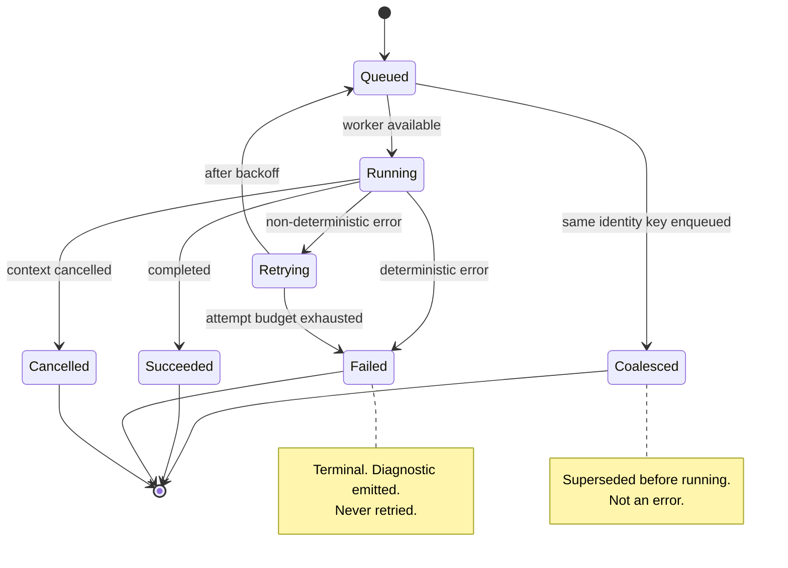
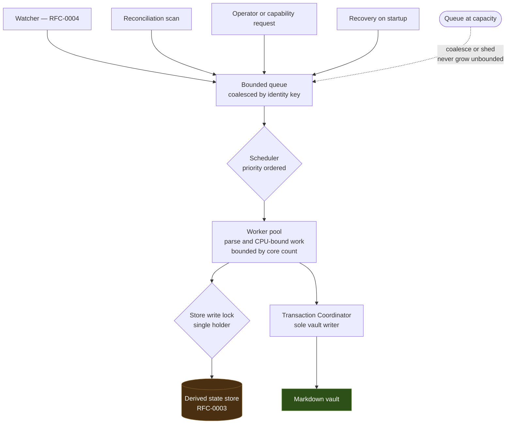
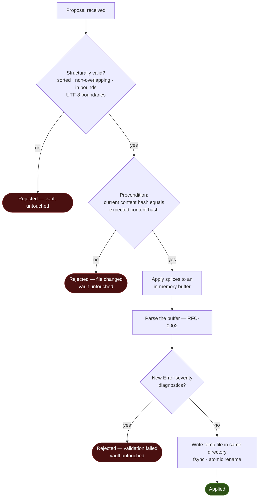
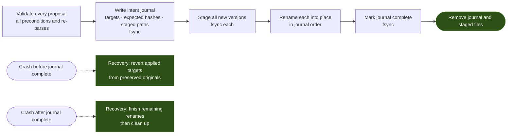

# RFC-0005: Background Worker & Job Engine

## Summary

Specifies asynchronous work — how it is scheduled, cancelled, retried, and recovered — and the **Transaction Coordinator**, the single component permitted to write to the vault.

Five decisions carry it:

1. **The job queue is not durable state.** Pending work is the difference between the vault and the store, so it is *recomputable*. Losing the queue on a crash cannot change the post-recovery result. There is no persistent queue to corrupt, replay incorrectly, or migrate.
2. **Concurrency must not be observable in the result.** The final canonical dump must be identical for one worker or sixteen, under any scheduling order. Concurrency is a latency decision, never a correctness one.
3. **Only non-deterministic failures are retried.** A malformed file fails identically on the tenth attempt as on the first. Retrying deterministic failures buys nothing and hides real errors in log noise.
4. **Every vault write is validated by re-parsing the result.** A proposal is applied to a buffer, that buffer is parsed, and if new `Error`-severity diagnostics appear the write is rejected. This is Principle 3 — *AI never edits Markdown directly* — expressed as a mechanism rather than a promise.
5. **Cross-file atomicity requires a journal, and we say so.** POSIX gives atomic single-file replacement, not atomic multi-file replacement. A multi-note transaction uses an intent journal so recovery completes or reverses it; nothing is left half-applied and undetected.

## Motivation

Principle 8 requires heavy work to happen in the background. That is the easy half. The hard half is that a background engine is where correctness quietly degrades:

- A durable queue becomes a second source of truth about what needs doing, and drifts from the vault it was supposed to describe.
- Concurrency bugs produce a *mostly* correct index whose errors depend on machine speed, so they reproduce on a loaded laptop and never in CI.
- Retry loops turn a permanent failure into an infinite one.
- A crash during a multi-file edit leaves the user's vault in a state no one designed.

Each is addressed here by structure rather than by care, because care does not survive delegation to coding agents.

The Transaction Coordinator lives here rather than in its own RFC because it is a consumer of the same guarantees: it is a job, it is cancellable, it recovers, and it holds the write lock.

## Goals

- Define the job model, lifecycle, scheduling, and coalescing.
- Define cancellation, retry, and failure classification.
- Define crash recovery without a durable queue.
- Define the concurrency invariance property and how it is tested.
- Define the change-proposal format, its validation, and its application.
- Define multi-file transaction atomicity and its recovery journal.
- Resolve the open question carried from [RFC-0001](0001-project-vision.md): the wire format for agent-proposed changes.

## Non-Goals

- Filesystem watching, debouncing, and dirty-set maintenance — RFC-0004. This RFC schedules the work RFC-0004 identifies.
- Storage schema and the canonical dump — RFC-0003, consumed here.
- Approval workflows, agent policy, or who may propose what. This RFC specifies mechanism; policy is an M4 concern.
- Distributed or multi-process work queues. One process owns a workspace.
- Plugin-supplied jobs beyond reserving the seam. Plugin hosting is a future RFC.

## Background

Sits in the *Knowledge Engine* layer of [RFC-0001 §1](0001-project-vision.md). Consumes the parse model of [RFC-0002](0002-domain-model.md), including the byte-fidelity rule that makes splice-based edits possible, and the atomic-commit primitive and canonical dump of [RFC-0003](0003-storage-engine.md).

Edge cases referenced as `EC-*` are defined in the [test vault specification](../docs/testing/test-vault-spec.md).

## Proposed Design

### 1. Job Model

A **Job** (see [docs/glossary.md](../docs/glossary.md)) is a unit of asynchronous work with an identity, a lifecycle, and a cancellation contract.

| Field | Meaning |
| ----- | ------- |
| `kind` | `full_rebuild`, `index_batch`, `reconcile_scan`, `wal_checkpoint`, `apply_transaction` |
| `identity_key` | Coalescing key. Two queued jobs with the same key are one job. |
| `state` | See lifecycle below |
| `attempt` | Retry counter, reset on success |
| `checkpoint` | Opaque resume token, meaningful only to the job kind |
| `priority` | Interactive > incremental > maintenance |



**Idempotency is mandatory.** Every job must be safe to run twice, because recovery re-derives work and may re-run something that completed but was not yet observed as complete ([C-2](#c-2-idempotency)).

### 2. Scheduling & Backpressure



- **Parsing parallelizes; committing does not.** Parse work is CPU-bound and runs across the pool. Writes to the store serialize behind the single writer of [RFC-0003 §6](0003-storage-engine.md) ([C-6](#c-6-single-writer-discipline)).
- **The queue is bounded.** Under pressure, work is coalesced by `identity_key`, never accumulated without limit. A vault-wide find-and-replace producing fifty thousand events must not produce fifty thousand queued jobs ([C-11](#c-11-bounded-queue)).
- **Priority is a latency device, not a correctness device.** Reordering must not change final state — exactly what [C-3](#c-3-concurrency-invariance) tests.

### 3. Cancellation

Every job receives a cancellation context and must observe it at bounded intervals — between batches, between files, between splices. A job that checks cancellation only at completion is not cancellable.

**The M1 cancellation bound is 5 seconds**, applying uniformly to every job kind. A job kind may declare a shorter bound; none may exceed it without an RFC amendment. The number is a starting point chosen to be comfortably longer than a single batch and comfortably shorter than a user's patience during shutdown — it is expected to be tightened per kind once measured, which is a tuning change rather than a design one.

Shutdown cancels all jobs, waits for the bound, and exits. An unresponsive job is a bug reported by the shutdown path, not something the process waits on indefinitely ([C-4](#c-4-bounded-cancellation)).

This makes the M1-A definition of done — *exit cleanly* — mechanically checkable rather than aspirational.

### 4. Failure Classification & Retry

| Class | Examples | Retried? |
| ----- | -------- | -------- |
| **Non-deterministic** | Transient I/O error, lock contention, file vanished mid-read, resource exhaustion | Yes — bounded exponential backoff, capped attempt budget |
| **Deterministic** | Malformed input, failed validation, precondition mismatch, unsupported encoding | **No** — terminal, diagnostic emitted |

A deterministic failure retried is a permanent failure converted into an infinite one, and its log output buries the incident that matters ([C-5](#c-5-retry-only-non-deterministic-failures)).

Note the asymmetry with parsing: RFC-0002 makes parsing *total*, so a malformed file does not fail a job at all — it produces a `Note` with diagnostics. Deterministic job failure is therefore rare by construction, and worth treating as a real signal when it occurs.

### 5. Crash Recovery Without a Durable Queue

On startup the engine does not restore a queue. It computes one:

```text
work = diff(vault, store)
```

The vault is authoritative; the store records what has been indexed and the content hash of each note ([RFC-0003 §3](0003-storage-engine.md)). Their difference *is* the pending work. A queue persisted across restarts would be a second, weaker description of the same fact — one that can disagree with reality and has no way to detect that it has.

This is [RFC-0001 §2](0001-project-vision.md)'s exemption used precisely: ephemeral runtime state is permitted exactly when its loss cannot change a query answer after recovery ([C-1](#c-1-queue-is-not-durable-state)).

**In-flight proposals are lost on crash, and that is correct.** A proposal not yet applied left the vault untouched; there is nothing to recover. A proposal already applied is in the vault, and the reconciliation diff will index it. The only case needing more is a *multi-file* transaction interrupted mid-apply — §7.

An optional persisted queue is permitted strictly as a startup-latency optimization, and only while discarding it produces identical results. If that property ever fails to hold, the optimization is the bug.

### 6. The Transaction Coordinator

The sole component permitted to write vault files ([RFC-0001/C-3](0001-project-vision.md#c-3-single-write-path)).

**Change proposal** — resolving the open question carried from RFC-0001:

```yaml
note_id: notes/architecture.md
expected_content_hash: "sha256:0000000000000000000000000000000000000000000000000000000000000000"
splices:
  - range_start: 1024
    range_end: 1088
    replacement: "new text"
  - range_start: 2210
    range_end: 2210          # empty range = insertion
    replacement: "inserted text"
```

Structural rules — all rejections, never repairs:

- Splices are **sorted ascending and non-overlapping**. Overlap is a malformed proposal, not something to merge.
- Ranges lie within the file and on UTF-8 character boundaries.
- An empty range is an insertion; an empty replacement is a deletion.
- Application proceeds **right to left**, so earlier offsets stay valid without recomputation.
- The proposal carries no formatting intent, no "rewrite this section" verb, and no whole-file content. It *cannot* express reformatting, because RFC-0002 removed the ability to serialize a note at all.



Three properties worth naming:

**The precondition is optimistic concurrency against the user's own editor.** RFC-0002 byte ranges are valid only against the exact bytes parsed. If the user saved the file after the proposal was computed, the hash differs and the proposal is rejected rather than applied at shifted offsets ([C-7](#c-7-transaction-precondition)). This is what makes a live editor and a background agent safe in the same directory.

**Post-condition re-parse is what "never unvalidated" means.** An edit that would introduce broken frontmatter or an unterminated code fence is refused before any byte reaches disk ([C-8](#c-8-post-condition-validation)).

**A rejected proposal leaves every vault file byte-identical** ([C-10](#c-10-rejection-is-inert)) — the same assertion RFC-0001 makes, tested here where the write path actually lives.

### 7. Multi-File Transactions

POSIX offers atomic replacement of one file. It does not offer atomic replacement of several. Renames across a set of files cannot be made simultaneous, so a crash between them leaves some applied and some not.

Rather than pretend otherwise, multi-file transactions use an intent journal kept outside the vault:



- Validation for **every** file completes before **any** file is written. A transaction that would fail on its last file never touches its first.
- The journal is not derived state and is not the store; it is a crash-recovery artefact with a lifetime measured in milliseconds.
- Recovery runs before any indexing on startup, so the engine never indexes a half-applied transaction ([C-9](#c-9-multi-file-recovery)).
- **Recovery also removes orphaned staged files.** A crash between staging and the journal being marked complete leaves staged versions on disk with no journal entry referring to them. Recovery deletes any staged file not named by a live journal, so the staging area does not accumulate debris across crashes. This is explicit rather than implied: "recovery runs before indexing" says *when*, not *what*.
- Original content of every target is preserved until the journal is marked complete, which is what makes reversal possible.

Single-file transactions — expected to be the overwhelming majority — skip the journal entirely and rely on rename atomicity.

### 8. Job Kinds

| Kind | Trigger | Checkpoint | Notes |
| ---- | ------- | ---------- | ----- |
| `full_rebuild` | Version mismatch, corruption, operator request | Per batch | Owns the rebuild flow of [RFC-0003 §5](0003-storage-engine.md); resolves that RFC's granularity question in favour of **per batch** |
| `index_batch` | Dirty set from RFC-0004 | Per batch | The common path |
| `reconcile_scan` | Startup, watcher gap, periodic | Per directory subtree | Recovers missed events (`EC-DYN-004`, `EC-DYN-006`) |
| `wal_checkpoint` | Schedule or WAL size threshold | None | Maintenance priority; owns the schedule RFC-0003 defers here |
| `apply_transaction` | Capability request | None | §6/§7; never batched with indexing work |

### 9. Diagnostics

Job-domain diagnostics use `LITH-J-NNNN`, parallel to `LITH-P-` (parsing) and `LITH-S-` (storage). Codes are stable and part of the public contract; message text is not.

Every terminal job state emits a diagnostic. A cancelled job is `Info`; a deterministic failure is `Error`. Silent failure is prohibited — a job ending without a recorded outcome is itself a defect.

## Alternatives Considered

1. **Durable persistent queue.** Rejected: it becomes a second source of truth about pending work, can disagree with the vault, and needs its own consistency and migration story — for a fact that is one diff away.
2. **Retrying every failure uniformly.** Rejected: converts permanent failures into infinite loops and buries genuine incidents in noise.
3. **Whole-file replacement as the proposal format.** Rejected: it permits reformatting the user's file as a side effect and makes review of an agent's intent impossible — the diff would be the whole document. It is also unrepresentable, since RFC-0002 exposes no serializer.
4. **Line-based proposals.** Rejected for consistency with RFC-0002: line numbering is line-ending dependent, so a CRLF file and an LF file with identical content would require different proposals (`EC-ENC-002`, `EC-ENC-003`).
5. **Locking vault files during edits.** Rejected: advisory locks are unreliable across editors and platforms, and would make Lith interfere with the user's own tools. Optimistic content-hash preconditions achieve the safety without claiming ownership.
6. **Claiming multi-file atomicity without a journal.** Rejected as false. Either the guarantee is implemented or it is not offered.
7. **Serializing all work onto one goroutine.** Rejected: parsing dominates cost at scale and parallelizes cleanly; the correct constraint is a single *writer*, not a single worker.

## Risks

| Risk | Mitigation |
| ---- | ---------- |
| **Concurrency bug produces machine-speed-dependent state** | [C-3](#c-3-concurrency-invariance) runs the corpus at multiple worker counts with shuffled scheduling and compares canonical dumps |
| **Event storm floods the queue** | Bounded queue with coalescing by `identity_key` ([C-11](#c-11-bounded-queue)) |
| **Job ignores cancellation and blocks shutdown** | Bounded-cancellation assertion ([C-4](#c-4-bounded-cancellation)); shutdown reports the offender rather than waiting |
| **Crash mid multi-file transaction** | Intent journal with recovery before indexing ([C-9](#c-9-multi-file-recovery)) |
| **Proposal applied against a file the user just changed** | Content-hash precondition ([C-7](#c-7-transaction-precondition)) |
| **Agent proposes a structurally valid but semantically destructive edit** | Post-condition re-parse ([C-8](#c-8-post-condition-validation)); policy-level review is M4 |
| **Journal itself becomes durable state** | Journal is a recovery artefact only; its absence at startup is the normal case, and queries never consult it |

## Migration

None. No implementation exists.

## Conformance

### C-1: Queue is not durable state

**Assertion:** Discarding all in-memory and persisted queue state MUST NOT change the canonical dump produced after recovery. Pending work MUST be derivable from the vault and store alone.
**Verification:** Integration test — begin indexing the corpus, kill the process at randomized points, restart, allow completion; the canonical dump must equal the dump from an uninterrupted run.
**Milestone:** M1-A

### C-2: Idempotency

**Assertion:** Running any job twice MUST produce the same canonical dump as running it once.
**Verification:** Per-kind test executing each job twice in succession and comparing dumps.
**Milestone:** M1-B

### C-3: Concurrency invariance

**Assertion:** The final canonical dump MUST be identical for any worker-pool size and any scheduling order.
**Verification:** Index the corpus at worker counts 1, 2, 4, 8, and 16 with randomized queue ordering per run; all resulting dumps must be identical. Supports [RFC-0003/C-1](0003-storage-engine.md#c-1-rebuild-determinism).
**Milestone:** M1-B

### C-4: Bounded cancellation

**Assertion:** Every job MUST observe cancellation and terminate within the declared bound of **5 seconds** (§3), or within a shorter bound it declares for itself. No job may check cancellation only at completion.
**Verification:** Test cancelling each job kind mid-execution and asserting termination within its bound, plus a static check that long-running loops carry a cancellation check.
**Milestone:** M1-A

### C-5: Retry only non-deterministic failures

**Assertion:** Deterministic failures MUST NOT be retried. Only failures classified non-deterministic MAY be retried, under a capped attempt budget.
**Verification:** Test injecting one failure of each class and asserting attempt counts — exactly one for deterministic, bounded and capped for non-deterministic.
**Milestone:** M1-B

### C-6: Single-writer discipline

**Assertion:** At most one job MAY hold the store write lock at any time. Store-writing work MUST NOT proceed concurrently.
**Verification:** Instrumented test asserting the lock is never held by two jobs; race detector enabled across the concurrency suite.
**Milestone:** M1-B

### C-7: Transaction precondition

**Assertion:** A proposal whose `expected_content_hash` does not match the file's current content MUST be rejected, and the vault MUST remain unmodified.
**Verification:** Test modifying the target file between proposal construction and application; assert rejection and a byte-identical vault.
**Milestone:** M1-B

### C-8: Post-condition validation

**Assertion:** A proposal whose applied result introduces new `Error`-severity diagnostics MUST be rejected before any byte is written to the vault.
**Verification:** Tests applying proposals that would produce malformed frontmatter, an unterminated code fence, and invalid UTF-8; each must be rejected with the vault byte-identical.
**Milestone:** M1-B

### C-9: Multi-file recovery

**Assertion:** After a crash during a multi-file transaction, recovery MUST leave every target either fully applied or fully reverted. A half-applied transaction MUST NOT be indexed.
**Verification:** Crash-injection test at each labelled point of the journal flow; after recovery, vault contents must match one of the two expected states exactly, and recovery must complete before indexing begins.
**Milestone:** M1-B

### C-10: Rejection is inert

**Assertion:** A rejected proposal, for any rejection reason, MUST leave every vault file byte-identical.
**Verification:** Test enumerating every rejection path, with a SHA-256 manifest of the vault taken before and after; manifests must match. Complements [RFC-0001/C-3](0001-project-vision.md#c-3-single-write-path).
**Milestone:** M1-B

### C-11: Bounded queue

**Assertion:** The queue MUST NOT grow without bound. Work exceeding capacity MUST be coalesced by `identity_key` or shed, never accumulated.
**Verification:** Load test generating events far exceeding queue capacity; assert bounded queue depth and a correct final canonical dump.
**Milestone:** M1-D

## Open Questions

- [ ] Attempt budget and backoff parameters for non-deterministic failures. *Tuning values; [C-5](#c-5-retry-only-non-deterministic-failures) holds for any capped budget.*
- [x] ~~Cancellation bound per job kind.~~ **Resolved:** a single global bound of 5 seconds for M1, declared in §3, with per-kind tightening after measurement. [C-4](#c-4-bounded-cancellation) now asserts against a stated number.
- [ ] Does `apply_transaction` block indexing of its targets, or race it and rely on the content-hash precondition? *Leaning block-then-index for reviewability; either satisfies the assertions.*
- [ ] Does the intent journal live beside the store or in a dedicated recovery directory? *Placement only; the vault-isolation rule of [RFC-0003/C-6](0003-storage-engine.md#c-6-vault-isolation) applies either way.*

## Future Work

- **RFC-0004** — Indexing & Link Graph Engine *(next, and the last of the five RFCs that gate M1 implementation: it produces the dirty set this engine schedules)*
- *Future:* plugin-supplied job kinds behind the plugin boundary; approval and policy layer for agent proposals (M4); multi-workspace scheduling

## Acceptance Checklist

- [x] Every `Conformance` assertion has a Verification method and an owning milestone — all eleven
- [x] No assertion depends on unresolved *Open Questions* — the cancellation bound C-4 depended on is now declared in §3; the remaining questions are tuning or placement and touch no assertion
- [x] *Non-Goals* are explicit
- [x] At least one diagram covering the primary data flow, component topology, or state lifecycle — four: job lifecycle, scheduling, proposal validation, transaction journal
- [x] Every diagram validated as Mermaid by a parser, not by eye — 4/4 valid
- [x] All domain terms used normatively exist in [docs/glossary.md](../docs/glossary.md) — *Change Proposal*, *Intent Journal*, *Identity Key* are added in stack 3 ([RFC-0001](0001-project-vision.md)), which merges before this PR
- [x] No conflict with [PROJECT_PRINCIPLES.md](../PROJECT_PRINCIPLES.md)
- [x] **N/A** — this RFC names no capability. It specifies the job and transaction subsystem; [CAP-0004 Jobs](../docs/reference/capability-catalog.md) and [CAP-0005 Transactions](../docs/reference/capability-catalog.md) name RFC-0005 as owner, but the capabilities themselves are catalogued there rather than defined here
- [x] Every `EC-*` case referenced exists in [docs/testing/test-vault-spec.md](../docs/testing/test-vault-spec.md)
- [x] [rfcs/index.md](index.md) and [ARCHITECTURE.md](../ARCHITECTURE.md) rows updated, including the added `requires: "0003"` — corrected on `main`
- [x] Reviewed and approved by maintainers

## References

### Internal

- [RFC-0001: Project Vision & Strategic Architecture](0001-project-vision.md)
- [RFC-0002: Domain Model & Vault AST](0002-domain-model.md)
- [RFC-0003: Storage Engine & State Rebuilds](0003-storage-engine.md)
- [PROJECT_PRINCIPLES.md](../PROJECT_PRINCIPLES.md)
- [docs/glossary.md](../docs/glossary.md)
- [docs/testing/test-vault-spec.md](../docs/testing/test-vault-spec.md)
- [rfcs/README.md](README.md)

### External

- [Go Concurrency Patterns](https://go.dev/blog/pipelines)
- [Go context package](https://pkg.go.dev/context)
- [SQLite Atomic Commit](https://www.sqlite.org/atomiccommit.html)
- [RFC 2119 — Key words for use in RFCs](https://www.rfc-editor.org/rfc/rfc2119)
