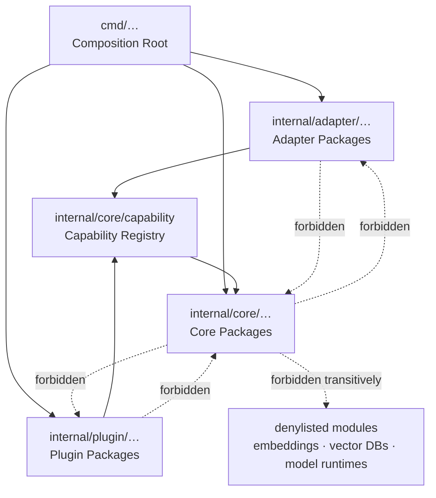

# RFC-0006: Package Layout & Dependency Boundaries

## Summary

Fixes the Go module path, the repository's package layout, and the import-direction rules between package classes. It specifies no runtime behaviour. Its purpose is to give [RFC-0001/C-1](0001-project-vision.md#c-1-core-semantic-independence) and [RFC-0001/C-5](0001-project-vision.md#c-5-interface-adapter-purity) a referent they can be checked against: both assertions are written in terms of "core packages" and "interface adapters", and neither term currently denotes anything.

## Motivation

Three accepted assertions are unverifiable today, for the same reason.

* **RFC-0001/C-1** forbids the core engine from acquiring a dependency on embeddings, vector databases, or model runtimes. Its verification is a dependency-boundary check over the resolved import graph. There is no import graph, and no definition of which packages are "core".
* **RFC-0001/C-5** requires interface adapters to reach the engine only through the capability registry. "Adapter" is likewise undefined.
* **RFC-0003/C-6** (vault isolation) constrains where process state may live, which is a filesystem question rather than a package one, but the daemon that creates that state has nowhere to be written.

Meanwhile [AGENTS.md](../AGENTS.md) §1.3 forbids agents from introducing Go directory structures without an active RFC — correctly, because layout chosen by whoever writes the first file becomes permanent by accretion. The combined effect is that M1-A cannot begin. This RFC is the smallest thing that unblocks it.

The design goal is that **class membership is a property of a package's path, not of a reviewer's judgement.** A boundary rule that requires someone to decide whether a package "feels like core" is not a rule; it is a preference that decays. A rule expressed as a path predicate is checkable by `go list` in CI, on every pull request, forever.

## Goals

* Fix the module path and the top-level directory layout.
* Define four package classes by path, so that every boundary rule reduces to a mechanical check.
* Specify the import-direction rules between those classes.
* Specify a checked-in denylist of module paths the core may never reach, transitively.
* Choose a layout that absorbs M1-B through M4 without renaming anything.

## Non-Goals

* **No decomposition of M1-A internals.** The package names listed under *Initial Packages* are informative. Adding a package inside an existing class needs no RFC.
* **No public SDK surface.** The Go SDK is M3-D; see *Future Work*.
* **No CI workflow definition.** This RFC specifies what must be checked, not the YAML that runs it. The workflow is implementation work owned by the CI epic.
* **No build, release, or packaging tooling.**
* **No plugin sandboxing model.** This RFC places the plugin host in the layout; [RFC-0001 §4](0001-project-vision.md) owns its semantics.

## Background

[RFC-0001](0001-project-vision.md) establishes a layer model in which the core engine is semantically independent, interface adapters are peers wrapping it, and plugins are optional. That model is architectural prose. This RFC is its projection onto a filesystem, and nothing more — where the two appear to disagree, RFC-0001 governs and this RFC is wrong.

## Proposed Design

### Module Path

```text
module github.com/lith-project/lith
```

### Directory Layout

```text
lith/
├── cmd/
│   ├── lith/                 Composition Root — CLI binary
│   └── lithd/                Composition Root — daemon binary
├── internal/
│   ├── core/                 Core Packages — the engine
│   │   └── capability/       the registry; the only inbound door to core
│   ├── adapter/              Adapter Packages — CLI, REST, MCP, SDK surfaces
│   └── plugin/               Plugin Packages — the plugin host
├── tools/                    repository tooling; outside all four classes
│   └── conformance/          boundary checker and its denylist
└── tests/vault/              committed corpus (existing, unchanged)
```

### Package Classes

Membership is determined solely by path prefix within the main module.

| Class | Path prefix | Role |
| --- | --- | --- |
| **Composition Root** | `cmd/…` | Wires concrete implementations together and runs them. May import anything. |
| **Core Package** | `internal/core/…` | The engine. Semantically independent per [PROJECT_PRINCIPLES.md](../PROJECT_PRINCIPLES.md) §9. |
| **Adapter Package** | `internal/adapter/…` | Interface surfaces. Peers, none privileged. |
| **Plugin Package** | `internal/plugin/…` | The Plugin Host and the optional capabilities it loads. |

`tools/…` is deliberately outside every class: it is repository machinery, not product, and holds the checker that enforces the classes.

### Import Direction



The asymmetry is the point. Core has exactly one inbound door — `internal/core/capability` — and no outbound edge to anything above it. An adapter or plugin that needs something core has today and the registry does not expose has found a missing capability, not a reason to reach past it.

The Composition Root is exempt from the direction rules because that is precisely its job: something must know about every layer in order to assemble them, and confining that knowledge to `main` is what keeps it out of everywhere else. The CLI root `cmd/lith` is the exception to that exemption: because it presents an interface, C-3 restricts its Core Package imports to the Capability Registry. In exchange, nothing may import a Composition Root.

### The Denylist

`tools/conformance/core-dependency-denylist.txt` holds one Go module path prefix per line, `#` for comments. The check resolves the **transitive** dependency graph of every Core Package (`go list -deps`) and fails if any resolved module matches a prefix. Transitivity is essential: a core package importing a benign helper that itself pulls in a vector client has acquired the dependency just as surely as if it imported it directly, and that is exactly the accretion [PROJECT_PRINCIPLES.md](../PROJECT_PRINCIPLES.md) §9 exists to prevent.

An entry is removed, or an exception granted, only by amending this RFC. There is no inline suppression comment, because a suppression comment is how a boundary becomes decorative.

### Initial Packages

Informative. These are the Core Packages M1-A is expected to create; adding to this list requires no amendment.

`internal/core/config` · `internal/core/logging` · `internal/core/vaultpath` · `internal/core/watch` · `internal/core/debounce` · `internal/core/queue` · `internal/core/daemon`

`internal/adapter/` and `internal/plugin/` are empty in M1-A and are created by the milestones that need them (M1-C and M2-C respectively).

## Alternatives Considered

1. **`pkg/` for public code, `internal/` for private.** Rejected. `pkg/` advertises a supported public surface, and Lith has none until M3-D. Creating it now invites packages to be exported before anyone has decided they are API, which is the failure mode `internal/` exists to prevent. When the SDK lands it gets a deliberate surface, designed once.

2. **Flat top-level domain packages — `config/`, `watch/`, `queue/`.** Rejected. It reads well and destroys the checkability that motivates this RFC: with no class prefixes, "is this a core package?" becomes a hand-maintained list in the checker, and a hand-maintained list drifts from the tree it describes. The path predicate is the whole mechanism.

3. **Enforce boundaries by convention and code review.** Rejected on the project's own stated grounds. [rfcs/README.md](README.md) observes that a coding agent can produce compiling, passing code that quietly abandons the intended architecture. Review catches that only when the reviewer already suspects it. A static check catches it on the pull request that introduces it.

## Risks

* **Class membership is coupled to directory names.** Moving a package out of `internal/core/` silently exempts it from the denylist. Mitigated by C-1: any package outside the four classes fails the build, so the escape hatch is a build break rather than a silent pass.
* **The denylist is an enumeration, and enumerations are never complete.** A vector database released next year is not on it. This is a real, unmitigated residual risk, and it is stated plainly rather than papered over: the denylist is a floor that catches known accretion, not a proof of independence. RFC-0001/C-1 remains the assertion; this is one verification of it.
* **Transitive matching can flag a benign module** that happens to vendor a denylisted path. Mitigated by requiring an RFC amendment rather than an inline suppression, which keeps the exception visible and reviewed.
* **`internal/core/capability` does not exist until M1-C**, so C-3 cannot be exercised before then. Accepted: the assertion carries M1-C as its owning milestone and the checker skips a rule whose subject class is empty.

## Migration

None. No Go code exists in the repository.

## Conformance

### C-1: Package classification is total

**State:** Active
**Assertion:** Every Go package in the main module outside `tools/…` MUST reside under `cmd/`, `internal/core/`, `internal/adapter/`, or `internal/plugin/`. Introducing a fifth class MUST require an amendment to this RFC.
**Verification:** CI static check enumerating packages via `go list ./...` and failing on any path matching none of the four prefixes.
**Milestone:** M1-A

### C-2: Core packages do not import upward

**State:** Active
**Assertion:** A Core Package MUST NOT import an Adapter Package, a Plugin Package, or a Composition Root package.
**Verification:** CI static check over the resolved import graph of `internal/core/...`.
**Milestone:** M1-A

### C-3: Adapter purity

**State:** Active
**Assertion:** An Adapter Package and the CLI Composition Root `cmd/lith` MUST NOT import any Core Package other than `internal/core/capability`.
**Verification:** CI static check over the direct imports of every package under `internal/adapter/...` and `cmd/lith`; each import whose path begins `github.com/lith-project/lith/internal/core/` MUST equal `github.com/lith-project/lith/internal/core/capability`. This is the mechanical form of [RFC-0001/C-5](0001-project-vision.md#c-5-interface-adapter-purity). Transitive Core Package dependencies reached through the Capability Registry are permitted.
**Milestone:** M1-C

This assertion is first enforced in M1-C, when both the Capability Registry and `cmd/lith` exist; M1-A creates neither subject package.

### C-4: Core dependency denylist

**State:** Active
**Assertion:** The transitive module dependency graph of every Core Package MUST NOT contain any module path matching a prefix in `tools/conformance/core-dependency-denylist.txt`.
**Verification:** CI static check over `go list -deps ./internal/core/...`. This is the mechanical form of [RFC-0001/C-1](0001-project-vision.md#c-1-core-semantic-independence).
**Milestone:** M1-A

### C-5: Composition roots are not importable

**State:** Active
**Assertion:** No package MUST import a package under `cmd/`.
**Verification:** CI static check over the reverse import graph of `cmd/...`.
**Milestone:** M1-A

### C-6: The checker detects violations

**State:** Active
**Assertion:** The boundary checker MUST exit non-zero when given a tree containing a planted violation of C-1, C-2, C-4, or C-5.
**Verification:** Test executing the checker against fixture trees under `tools/conformance/testdata/`, one per assertion, each asserting a non-zero exit and a message naming the violated assertion.
**Milestone:** M1-A

> C-6 exists because a check that never fails is indistinguishable from a check that cannot fail, and the second is worse than no check at all — it converts an unverified boundary into a verified-looking one.

### C-7: Plugin purity

**State:** Active
**Assertion:** A Plugin Package MUST NOT import any Core Package other than `internal/core/capability`.
**Verification:** CI static check over the direct imports of every package under `internal/plugin/...`; each import whose path begins `github.com/lith-project/lith/internal/core/` MUST equal `github.com/lith-project/lith/internal/core/capability`. Transitive Core Package dependencies reached through the Capability Registry are permitted.
**Milestone:** M2-C

## Open Questions

* [ ] Whether Go-based repository tooling under `tools/` should become a separate Go module, to keep its dependencies out of the main module's graph. This affects no assertion: C-1 scopes classification to the main module outside `tools/`, and C-4 resolves only from `internal/core/...`.

## Future Work

* **Public Go SDK surface (M3-D).** The SDK is currently an Adapter Package and therefore unimportable from outside. Exposing it means a deliberate root-level package re-exporting through the capability registry, and a fifth class — which C-1 requires an amendment to add, by design.
* **REST and MCP adapters (M3-B, M3-C)**, which populate `internal/adapter/` and make C-3 load-bearing.
* **Plugin sandboxing (M2-C)**, which will likely add constraints on what a Plugin Package may import.

## Acceptance Checklist

* [x] Every `Conformance` assertion has a state, a Verification method, and an owning milestone — all seven
* [x] No assertion depends on unresolved *Open Questions*
* [x] *Non-Goals* are explicit
* [x] At least one diagram covering the primary data flow, component topology, or state lifecycle of the proposal. A diagram must carry information the prose does not; a box-and-arrow restatement of a paragraph does not satisfy this item
* [x] Every diagram validated as Mermaid by a parser, not by eye — parsed as `flowchart`, `valid: true`
* [x] All domain terms used normatively exist in [docs/glossary.md](../docs/glossary.md); new terms added there in the same PR
* [x] No conflict with [PROJECT_PRINCIPLES.md](../PROJECT_PRINCIPLES.md); any proposed amendment is stated verbatim in this RFC
* [x] **N/A** — this RFC names no capability. It names the *package* that will host the Capability Registry, which is not a capability instance.
* [x] [rfcs/index.md](index.md) and [ARCHITECTURE.md](../ARCHITECTURE.md) rows updated
* [ ] Reviewed and approved by maintainers

## References

### Internal

* [RFC-0001: Project Vision & Strategic Architecture](0001-project-vision.md)
* [PROJECT_PRINCIPLES.md](../PROJECT_PRINCIPLES.md)
* [AGENTS.md](../AGENTS.md)
* [docs/glossary.md](../docs/glossary.md)

### External

* [Go Modules Reference](https://go.dev/ref/mod)
* [`go list` command documentation](https://pkg.go.dev/cmd/go#hdr-List_packages_or_modules)
